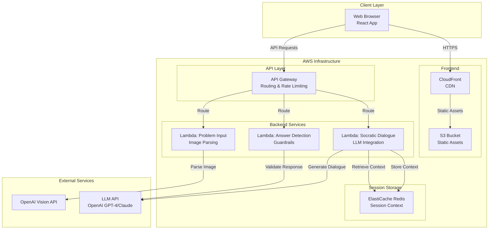
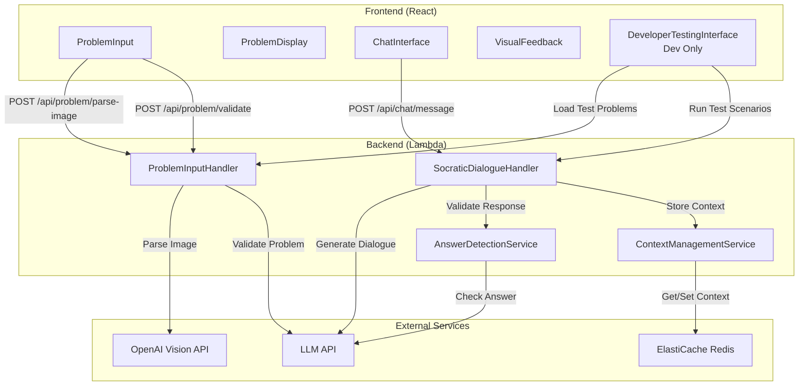
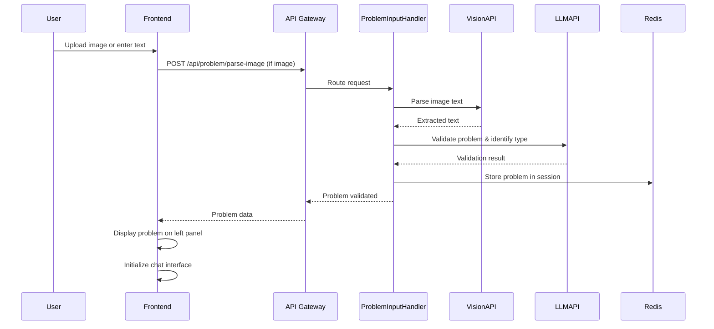
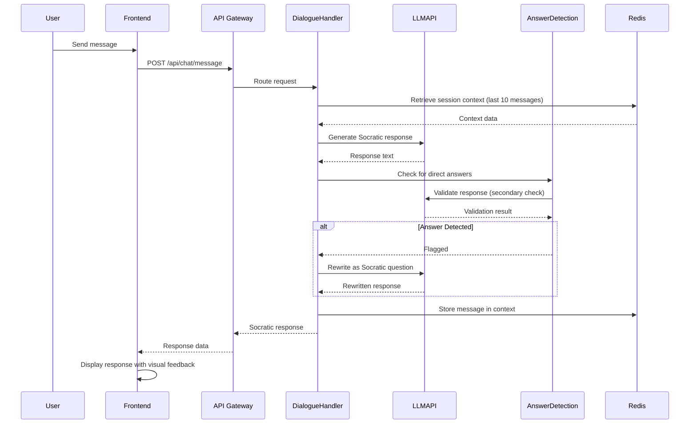
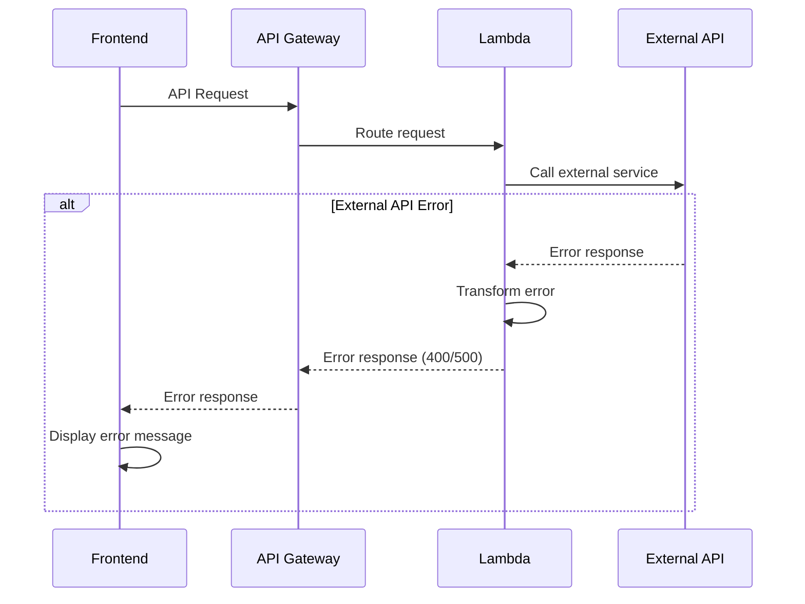
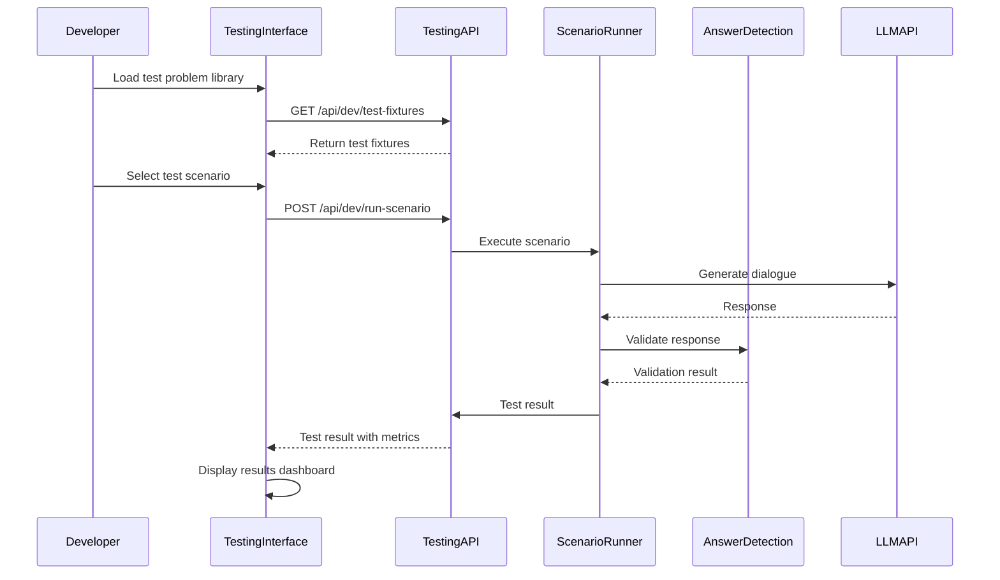

# AI Math Tutor Fullstack Architecture Document

## Introduction

This document outlines the complete fullstack architecture for AI Math Tutor, including backend systems, frontend implementation, and their integration. It serves as the single source of truth for AI-driven development, ensuring consistency across the entire technology stack.

This unified approach combines what would traditionally be separate backend and frontend architecture documents, streamlining the development process for modern fullstack applications where these concerns are increasingly intertwined.

### Starter Template or Existing Project

**Status:** N/A - Greenfield project

The PRD specifies a monorepo structure combining frontend and backend code in a single repository. No existing starter template or codebase is mentioned. This is a greenfield project that will be built from scratch using modern fullstack patterns.

### Change Log

| Date       | Version | Description                                                        | Author    |
| ---------- | ------- | ------------------------------------------------------------------ | --------- |
| 2025-01-XX | 1.0     | Initial architecture document created                              | Architect |
| 2025-01-XX | 1.1     | Updated scope to 6th grade math, added developer testing interface | Architect |

## High Level Architecture

### Technical Summary

AI Math Tutor uses a serverless fullstack architecture with AWS Lambda functions for backend API endpoints, paired with a React frontend deployed as static assets. The system follows a monorepo structure combining frontend and backend TypeScript code in a single repository, enabling shared types and utilities across the stack. The architecture leverages AWS services (S3, CloudFront, API Gateway, ElastiCache/DynamoDB) for scalable, cost-effective deployment while maintaining clean separation between frontend UI, backend API services, and session management. The system integrates with OpenAI Vision API for image parsing and LLM APIs (OpenAI GPT-4 or Claude) for Socratic dialogue generation, with enforced answer detection guardrails ensuring pedagogical quality. The system is specifically designed for 6th grade mathematics (ages 11-12), focusing on core 6th grade math topics including operations with fractions and decimals, ratios and proportions, integers, introductory algebra, basic geometry, and multi-step word problems. A developer testing interface (development-only) enables streamlined testing workflows for rapid validation across all problem types and edge cases. This serverless approach provides the scalability and cost-effectiveness needed for an MVP while supporting the requirement for sub-3-second LLM response times and maintaining conversation context across 10+ message exchanges.

### Platform and Infrastructure Choice

**Platform:** AWS Full Stack

**Key Services:**

- **Frontend:** AWS S3 + CloudFront (or AWS Amplify for full-stack deployment)
- **Backend:** AWS Lambda (serverless) for API endpoints
- **Session Storage:** AWS ElastiCache (Redis) for in-memory session management (last 10 messages)
- **API Gateway:** AWS API Gateway for API routing, rate limiting, and request management
- **CDN:** CloudFront for static asset delivery and edge caching

**Deployment Host and Regions:**

- Primary: US East (N. Virginia) us-east-1
- CDN: CloudFront global distribution

**Rationale:**
The PRD explicitly specifies AWS infrastructure with serverless architecture. AWS provides:

- **Cost-effectiveness for MVP:** Pay-per-use model ideal for initial deployment
- **Scalability:** Auto-scaling Lambda functions handle variable load
- **Integration:** Seamless integration between S3, CloudFront, API Gateway, and Lambda
- **Session Management:** ElastiCache (Redis) provides fast in-memory storage for session context (last 10 messages)
- **Alternative Considered:** Vercel + Supabase was considered but PRD constraints specify AWS

### Repository Structure

**Structure:** Monorepo

**Monorepo Tool:** npm workspaces (lightweight, no additional tooling required)

**Package Organization:**

- Root package.json manages workspace dependencies
- `apps/web/` - React frontend application
- `apps/api/` - Node.js/Express backend API
- `packages/shared/` - Shared TypeScript types and utilities
- `packages/config/` - Shared ESLint, TypeScript, Jest configurations

**Rationale:**
The PRD explicitly requires a monorepo structure. npm workspaces provides:

- Simple setup without additional tooling complexity
- Shared TypeScript types between frontend and backend
- Unified dependency management
- Easier context management across the stack
- Aligns with 3-day MVP timeline (minimal tooling overhead)

### High Level Architecture Diagram



### Architectural Patterns

- **Serverless Architecture:** Backend deployed as AWS Lambda functions - _Rationale:_ Cost-effective for MVP, auto-scaling, pay-per-use model, eliminates server management overhead

- **Jamstack Architecture:** Static frontend with serverless APIs - _Rationale:_ Optimal performance through static asset delivery via CloudFront, reduced backend load, improved security

- **Component-Based UI:** React functional components with TypeScript - _Rationale:_ Maintainability, reusability, type safety across UI components, aligns with modern React best practices

- **Repository Pattern:** Abstract data access for session management - _Rationale:_ Enables testing with mock implementations, future flexibility for storage backend changes

- **API Gateway Pattern:** Single entry point via AWS API Gateway - _Rationale:_ Centralized authentication, rate limiting, request routing, monitoring, and CORS handling

- **Two-Tier Guardrail Pattern:** Keyword-based + LLM-based answer detection - _Rationale:_ Defense in depth approach ensures 100% Socratic compliance, catches both explicit and implicit answers

- **Progressive Help Escalation:** Context-aware hint generation - _Rationale:_ Maintains pedagogical quality while adapting to student needs, prevents student abandonment

- **Session-Based Context Management:** In-memory storage of last 10 messages - _Rationale:_ Fast access, no persistence requirements per PRD, cost-effective for anonymous sessions

## Tech Stack

### Technology Stack Table

| Category             | Technology                         | Version       | Purpose                                     | Rationale                                                         |
| -------------------- | ---------------------------------- | ------------- | ------------------------------------------- | ----------------------------------------------------------------- |
| Frontend Language    | TypeScript                         | Latest        | Type-safe frontend development              | PRD requirement - all code must be TypeScript for type safety     |
| Frontend Framework   | React                              | Latest stable | Component-based UI with side-by-side layout | PRD requirement - React with functional components and Hooks      |
| UI Component Library | None (custom)                      | -             | Built-in components                         | PRD doesn't specify a UI library, custom components with Tailwind |
| State Management     | React Hooks (useState, useContext) | Built-in      | Client-side state management                | Simple state needs for MVP, no complex state management required  |
| Backend Language     | TypeScript                         | Latest        | Type-safe backend development               | PRD requirement - all code must be TypeScript                     |
| Backend Framework    | Express.js                         | Latest        | REST API endpoints                          | PRD requirement - Node.js/Express for API endpoints               |
| API Style            | REST                               | -             | Frontend-backend communication              | PRD requirement - RESTful API design                              |
| Database             | N/A                                | -             | No persistent storage                       | PRD specifies session-only storage (no persistence)               |
| Cache                | AWS ElastiCache (Redis)            | Latest        | Session context storage                     | PRD requirement - in-memory session management (last 10 messages) |
| File Storage         | N/A                                | -             | No file persistence                         | Images processed then discarded, no storage needed                |
| Authentication       | None                               | -             | Anonymous sessions                          | PRD requirement - anonymous sessions only, no auth needed         |
| Frontend Testing     | Jest + React Testing Library       | Latest        | Component and unit testing                  | Standard React testing stack                                      |
| Backend Testing      | Jest + Supertest                   | Latest        | API endpoint testing                        | Standard Node.js testing stack                                    |
| E2E Testing          | Deferred                           | -             | Post-MVP                                    | PRD specifies Unit + Integration only for MVP                     |
| Build Tool           | Vite                               | Latest        | Frontend build tool                         | Fast, modern build tool for React                                 |
| Bundler              | Vite (Rollup)                      | Latest        | Code bundling                               | Included with Vite                                                |
| IaC Tool             | AWS CDK or SAM                     | Latest        | Infrastructure as Code                      | AWS-native IaC tools                                              |
| CI/CD                | GitHub Actions                     | -             | Automated testing and deployment            | Standard CI/CD for GitHub repositories                            |
| Monitoring           | CloudWatch                         | AWS native    | Application monitoring                      | AWS-native monitoring solution                                    |
| Logging              | CloudWatch Logs                    | AWS native    | Application logging                         | AWS-native logging solution                                       |
| CSS Framework        | Tailwind CSS                       | v4.1.16       | Utility-first styling                       | PRD requirement - Tailwind CSS v4.1.16 for responsive design      |

### Technical Dependency Matrix

This section documents all technical dependencies, their versions, compatibility requirements, and dependency relationships. This ensures consistent versions across the monorepo and prevents dependency conflicts.

#### Runtime Environment Requirements

| Requirement | Minimum Version | Recommended Version    | Purpose                       | Notes                                               |
| ----------- | --------------- | ---------------------- | ----------------------------- | --------------------------------------------------- |
| Node.js     | v18.0.0         | v18.x LTS or v20.x LTS | JavaScript runtime            | Required for both frontend and backend              |
| npm         | v9.0.0          | v10.x or latest        | Package manager               | Included with Node.js, used for monorepo workspaces |
| TypeScript  | v5.0.0          | v5.3.x or latest       | Type checking and compilation | Required for all code (PRD requirement)             |

**Node.js Version Compatibility:**

- **Supported:** Node.js 18.x LTS, 20.x LTS
- **Not Supported:** Node.js 16.x or earlier (TypeScript 5.x requires Node 18+)
- **Rationale:** TypeScript 5.x and modern tooling require Node 18+

#### Frontend Dependencies

| Package              | Version | Purpose             | Dependencies          | Notes                               |
| -------------------- | ------- | ------------------- | --------------------- | ----------------------------------- |
| react                | ^18.2.0 | UI framework        | -                     | Latest stable React 18.x            |
| react-dom            | ^18.2.0 | React DOM bindings  | react                 | Must match React version            |
| typescript           | ^5.3.0  | Type checking       | -                     | Required for all .ts/.tsx files     |
| vite                 | ^5.0.0  | Build tool          | -                     | Fast build tool for React           |
| @vitejs/plugin-react | ^4.2.0  | Vite React plugin   | vite, react           | Required for React in Vite          |
| tailwindcss          | v4.1.16 | CSS framework       | -                     | PRD requirement - exact version     |
| katex                | ^0.16.0 | Math rendering      | -                     | LaTeX/KaTeX rendering for equations |
| react-katex          | ^3.0.0  | React KaTeX wrapper | react, katex          | React integration for KaTeX         |
| @types/react         | ^18.2.0 | TypeScript types    | react, typescript     | Must match React version            |
| @types/react-dom     | ^18.2.0 | TypeScript types    | react-dom, typescript | Must match React version            |
| @types/node          | ^20.0.0 | Node.js types       | typescript            | Node.js type definitions            |

**Frontend Dependency Compatibility Notes:**

- React 18.x is required for concurrent features and modern hooks
- TypeScript 5.x requires Node 18+ and provides better type inference
- Vite 5.x requires Node 18+ and provides fast HMR
- Tailwind CSS v4.1.16 is explicitly required by PRD (exact version)
- KaTeX 0.16.x is latest stable for math rendering
- All @types packages must match their corresponding package versions

#### Backend Dependencies

| Package                     | Version   | Purpose                | Dependencies        | Notes                                       |
| --------------------------- | --------- | ---------------------- | ------------------- | ------------------------------------------- |
| express                     | ^4.18.0   | Web framework          | -                   | Latest stable Express 4.x                   |
| typescript                  | ^5.3.0    | Type checking          | -                   | Shared with frontend                        |
| @types/express              | ^4.17.0   | TypeScript types       | express, typescript | Express type definitions                    |
| @types/node                 | ^20.0.0   | Node.js types          | typescript          | Node.js type definitions                    |
| aws-sdk                     | ^2.1500.0 | AWS SDK v2             | -                   | AWS service integration                     |
| @aws-sdk/client-s3          | ^3.0.0    | AWS S3 client          | -                   | Alternative: AWS SDK v3 (modular)           |
| @aws-sdk/client-lambda      | ^3.0.0    | AWS Lambda client      | -                   | Alternative: AWS SDK v3 (modular)           |
| @aws-sdk/client-elasticache | ^3.0.0    | AWS ElastiCache client | -                   | Alternative: AWS SDK v3 (modular)           |
| ioredis                     | ^5.3.0    | Redis client           | -                   | For ElastiCache (Redis) connection          |
| @types/ioredis              | ^5.0.0    | TypeScript types       | ioredis, typescript | Redis type definitions                      |
| openai                      | ^4.0.0    | OpenAI API client      | -                   | For Vision API and LLM API                  |
| @anthropic-ai/sdk           | ^0.9.0    | Anthropic Claude API   | -                   | Alternative LLM provider                    |
| cors                        | ^2.8.5    | CORS middleware        | express             | Required for frontend-backend communication |
| multer                      | ^1.4.5    | File upload middleware | express             | For image upload handling                   |
| @types/multer               | ^1.4.0    | TypeScript types       | multer, typescript  | Multer type definitions                     |
| @types/cors                 | ^2.8.0    | TypeScript types       | cors, typescript    | CORS type definitions                       |
| dotenv                      | ^16.3.0   | Environment variables  | -                   | For local development config                |

**Backend Dependency Compatibility Notes:**

- Express 4.x is stable and well-tested
- AWS SDK: Choose either v2 (aws-sdk) or v3 (modular @aws-sdk/client-\* packages)
  - **Recommendation:** Use AWS SDK v3 for better tree-shaking and smaller bundle size
- ioredis 5.x is latest stable for Redis connections
- OpenAI SDK 4.x is latest for GPT-4 and Vision API
- Anthropic SDK 0.9.x is latest for Claude API (alternative provider)

#### Testing Dependencies

| Package                     | Version | Purpose                     | Scope              | Notes                        |
| --------------------------- | ------- | --------------------------- | ------------------ | ---------------------------- |
| jest                        | ^29.7.0 | Testing framework           | Frontend + Backend | Latest Jest with ESM support |
| @testing-library/react      | ^14.1.0 | React testing utilities     | Frontend           | React component testing      |
| @testing-library/jest-dom   | ^6.1.0  | Jest DOM matchers           | Frontend           | Additional DOM matchers      |
| @testing-library/user-event | ^14.5.0 | User interaction testing    | Frontend           | User event simulation        |
| supertest                   | ^6.3.0  | HTTP assertion library      | Backend            | API endpoint testing         |
| @types/jest                 | ^29.5.0 | TypeScript types            | Frontend + Backend | Jest type definitions        |
| @types/supertest            | ^6.0.0  | TypeScript types            | Backend            | Supertest type definitions   |
| ts-jest                     | ^29.1.0 | TypeScript Jest transformer | Frontend + Backend | TypeScript support in Jest   |

**Testing Dependency Compatibility Notes:**

- Jest 29.x requires Node 18+ and supports ESM modules
- Testing Library 14.x is latest with React 18 support
- ts-jest 29.x must match Jest version for compatibility

#### Development Dependencies

| Package                          | Version | Purpose                  | Scope              | Notes                              |
| -------------------------------- | ------- | ------------------------ | ------------------ | ---------------------------------- |
| eslint                           | ^8.55.0 | Linter                   | Frontend + Backend | Code quality enforcement           |
| @typescript-eslint/parser        | ^6.15.0 | TypeScript ESLint parser | Frontend + Backend | TypeScript linting                 |
| @typescript-eslint/eslint-plugin | ^6.15.0 | TypeScript ESLint rules  | Frontend + Backend | TypeScript-specific rules          |
| eslint-plugin-react              | ^7.33.0 | React ESLint rules       | Frontend           | React-specific linting             |
| eslint-plugin-react-hooks        | ^4.6.0  | React Hooks linting      | Frontend           | React Hooks rules                  |
| prettier                         | ^3.1.0  | Code formatter           | Frontend + Backend | Code formatting                    |
| eslint-config-prettier           | ^9.1.0  | Prettier ESLint config   | Frontend + Backend | Prevents ESLint/Prettier conflicts |
| @types/node                      | ^20.0.0 | Node.js types            | Frontend + Backend | Shared Node.js types               |

**Development Dependency Compatibility Notes:**

- ESLint 8.x is stable and supports TypeScript 5.x
- TypeScript ESLint 6.x supports TypeScript 5.x
- Prettier 3.x is latest with improved formatting
- All ESLint plugins must be compatible with ESLint 8.x

#### Infrastructure Dependencies

| Service                 | Version/Region | Purpose              | Dependencies     | Notes                      |
| ----------------------- | -------------- | -------------------- | ---------------- | -------------------------- |
| AWS S3                  | Latest         | Static asset hosting | -                | Frontend deployment        |
| AWS CloudFront          | Latest         | CDN distribution     | AWS S3           | Global content delivery    |
| AWS Lambda              | Latest         | Serverless functions | AWS API Gateway  | Backend API endpoints      |
| AWS API Gateway         | Latest         | API routing          | AWS Lambda       | API request routing        |
| AWS ElastiCache (Redis) | Latest         | Session storage      | -                | In-memory session context  |
| AWS IAM                 | Latest         | Access control       | All AWS services | Security and permissions   |
| OpenAI API              | Latest         | Vision + LLM APIs    | -                | Image parsing and dialogue |
| Anthropic Claude API    | Latest         | Alternative LLM      | -                | Alternative LLM provider   |

**Infrastructure Dependency Compatibility Notes:**

- All AWS services use latest versions (managed services)
- AWS SDK must be compatible with service APIs
- OpenAI and Anthropic APIs are versioned independently
- Region: us-east-1 (primary) for cost-effectiveness

#### Shared Dependencies (Monorepo Root)

| Package    | Version | Purpose       | Scope  | Notes                  |
| ---------- | ------- | ------------- | ------ | ---------------------- |
| typescript | ^5.3.0  | Type checking | Shared | Root TypeScript config |
| eslint     | ^8.55.0 | Linter        | Shared | Root ESLint config     |
| prettier   | ^3.1.0  | Formatter     | Shared | Root Prettier config   |
| jest       | ^29.7.0 | Testing       | Shared | Root Jest config       |

**Shared Dependency Rationale:**

- TypeScript, ESLint, Prettier, and Jest are shared across frontend and backend
- Root-level configuration ensures consistency
- Package versions must match across all workspaces

#### Dependency Conflict Resolution

**Known Conflicts and Resolutions:**

1. **AWS SDK v2 vs v3:**
   - **Conflict:** Can't use both aws-sdk (v2) and @aws-sdk/client-\* (v3) simultaneously
   - **Resolution:** Choose one approach:
     - **Option A:** Use AWS SDK v2 (`aws-sdk`) - simpler, larger bundle
     - **Option B:** Use AWS SDK v3 (`@aws-sdk/client-*`) - modular, smaller bundle
   - **Recommendation:** Use AWS SDK v3 for better tree-shaking

2. **TypeScript Version Consistency:**
   - **Conflict:** Different TypeScript versions across workspaces
   - **Resolution:** Use exact same TypeScript version (^5.3.0) in root and all workspaces
   - **Enforcement:** Root package.json locks TypeScript version

3. **React Type Definitions:**
   - **Conflict:** @types/react version mismatch with react version
   - **Resolution:** @types/react version must match react version (both ^18.2.0)
   - **Enforcement:** Use peer dependency checks

4. **Node.js Version:**
   - **Conflict:** TypeScript 5.x requires Node 18+, but older Node versions might be used
   - **Resolution:** Enforce Node 18+ in .nvmrc and package.json engines field
   - **Enforcement:** CI/CD checks Node version

#### Version Pinning Strategy

**Pinned Versions (Exact):**

- `tailwindcss: v4.1.16` - PRD requirement, exact version
- `typescript: ^5.3.0` - Shared dependency, consistent version
- `react: ^18.2.0` - Core framework, stable version
- `node: ^18.0.0` - Runtime requirement, minimum version

**Version Ranges (Caret):**

- Most other packages use `^` (caret) for patch and minor updates
- Allows security patches and bug fixes
- Prevents breaking major version changes

**Lock File Strategy:**

- Use `package-lock.json` (npm) for deterministic installs
- Commit lock file to repository
- CI/CD uses `npm ci` for reproducible builds

#### Dependency Update Policy

**Monthly Updates:**

- Security patches: Immediate
- Bug fixes: Within 1 week
- Minor updates: Within 1 month
- Major updates: Require architecture review

**Update Process:**

1. Check for security vulnerabilities: `npm audit`
2. Review changelog for breaking changes
3. Test in development environment
4. Update lock file and commit
5. Verify CI/CD passes

#### Dependency Installation Order

**Root Dependencies (First):**

```bash
npm install  # Install root dependencies and create workspaces
```

**Workspace Dependencies (Second):**

```bash
npm install --workspace=apps/web  # Frontend dependencies
npm install --workspace=apps/api  # Backend dependencies
npm install --workspace=packages/shared  # Shared dependencies
```

**Or Install All:**

```bash
npm install  # Installs all workspace dependencies automatically
```

#### Compatibility Matrix

| Node.js | TypeScript | React  | Express | Jest   | Status                                              |
| ------- | ---------- | ------ | ------- | ------ | --------------------------------------------------- |
| 18.x    | 5.3.x      | 18.2.x | 4.18.x  | 29.7.x | ✅ Supported                                        |
| 20.x    | 5.3.x      | 18.2.x | 4.18.x  | 29.7.x | ✅ Supported                                        |
| 16.x    | 5.3.x      | 18.2.x | 4.18.x  | 29.7.x | ❌ Not Supported (TypeScript 5.x requires Node 18+) |
| 18.x    | 4.9.x      | 18.2.x | 4.18.x  | 29.7.x | ⚠️ Not Recommended (TypeScript 4.x is outdated)     |

**Recommended Configuration:**

- Node.js: 18.x LTS or 20.x LTS
- TypeScript: 5.3.x
- React: 18.2.x
- Express: 4.18.x
- Jest: 29.7.x

## Data Models

### Session

**Purpose:** Represents a browser session with conversation context and current problem state.

**Key Attributes:**

- `sessionId`: string - Unique session identifier
- `problem`: Problem | null - Current problem being solved
- `messages`: Message[] - Last 10 messages (user inputs and system responses)
- `createdAt`: Date - Session creation timestamp
- `lastActivityAt`: Date - Last activity timestamp for expiration

**TypeScript Interface:**

```typescript
interface Session {
  sessionId: string;
  problem: Problem | null;
  messages: Message[];
  createdAt: Date;
  lastActivityAt: Date;
}
```

**Relationships:**

- Contains one optional Problem
- Contains multiple Messages (max 10)

### Problem

**Purpose:** Represents a math problem submitted by the student.

**Key Attributes:**

- `id`: string - Unique problem identifier
- `text`: string - Problem statement text
- `type`: ProblemType - Problem category (arithmetic, algebra, geometry, word, multi-step)
- `source`: ProblemSource - Input method (text or image)
- `imageUrl?`: string - Optional image URL if uploaded (temporary)
- `createdAt`: Date - Problem submission timestamp

**TypeScript Interface:**

```typescript
enum ProblemType {
  ARITHMETIC = 'arithmetic',
  ALGEBRA = 'algebra',
  GEOMETRY = 'geometry',
  WORD = 'word',
  MULTI_STEP = 'multi-step',
}

enum ProblemSource {
  TEXT = 'text',
  IMAGE = 'image',
}

interface Problem {
  id: string;
  text: string;
  type: ProblemType;
  source: ProblemSource;
  imageUrl?: string;
  createdAt: Date;
}
```

**Relationships:**

- Belongs to one Session
- Has multiple Messages in conversation

### Message

**Purpose:** Represents a single message in the conversation (user input or system response).

**Key Attributes:**

- `id`: string - Unique message identifier
- `role`: MessageRole - Message sender (user or system)
- `content`: string - Message text content
- `timestamp`: Date - Message timestamp
- `metadata?`: MessageMetadata - Optional metadata (e.g., help level, validation result)

**TypeScript Interface:**

```typescript
enum MessageRole {
  USER = 'user',
  SYSTEM = 'system',
}

interface MessageMetadata {
  helpLevel?: number; // Progressive help escalation level
  answerDetected?: boolean; // Whether answer detection guardrail triggered
  validationResult?: string; // Student response validation result
}

interface Message {
  id: string;
  role: MessageRole;
  content: string;
  timestamp: Date;
  metadata?: MessageMetadata;
}
```

**Relationships:**

- Belongs to one Session
- References one Problem

## API Specification

### REST API Specification (OpenAPI 3.0)

```yaml
openapi: 3.0.0
info:
  title: AI Math Tutor API
  version: 1.0.0
  description: REST API for AI Math Tutor application
servers:
  - url: https://api.aimathtutor.com
    description: Production server
  - url: https://api-staging.aimathtutor.com
    description: Staging server

paths:
  /api/health:
    get:
      summary: Health check endpoint
      responses:
        '200':
          description: API is healthy
          content:
            application/json:
              schema:
                type: object
                properties:
                  status:
                    type: string
                    example: 'ok'
                  timestamp:
                    type: string
                    format: date-time

  /api/problem/parse-image:
    post:
      summary: Parse math problem from uploaded image
      requestBody:
        required: true
        content:
          multipart/form-data:
            schema:
              type: object
              properties:
                image:
                  type: string
                  format: binary
      responses:
        '200':
          description: Image parsed successfully
          content:
            application/json:
              schema:
                $ref: '#/components/schemas/ParsedProblem'
        '400':
          description: Invalid image or parsing failed
        '429':
          description: Rate limit exceeded

  /api/problem/validate:
    post:
      summary: Validate problem text and identify type
      requestBody:
        required: true
        content:
          application/json:
            schema:
              type: object
              required:
                - text
              properties:
                text:
                  type: string
                  description: Problem statement text
      responses:
        '200':
          description: Problem validated successfully
          content:
            application/json:
              schema:
                $ref: '#/components/schemas/ValidatedProblem'
        '400':
          description: Invalid problem text

  /api/chat/message:
    post:
      summary: Send message and receive Socratic dialogue response
      requestBody:
        required: true
        content:
          application/json:
            schema:
              type: object
              required:
                - sessionId
                - message
              properties:
                sessionId:
                  type: string
                  description: Session identifier
                message:
                  type: string
                  description: Student message
                problemId:
                  type: string
                  description: Current problem identifier
      responses:
        '200':
          description: Socratic dialogue response generated
          content:
            application/json:
              schema:
                $ref: '#/components/schemas/ChatResponse'
        '400':
          description: Invalid request
        '429':
          description: Rate limit exceeded

  /api/session:
    post:
      summary: Create new session
      responses:
        '200':
          description: Session created
          content:
            application/json:
              schema:
                $ref: '#/components/schemas/Session'
    get:
      summary: Get session context
      parameters:
        - name: sessionId
          in: query
          required: true
          schema:
            type: string
      responses:
        '200':
          description: Session context retrieved
          content:
            application/json:
              schema:
                $ref: '#/components/schemas/Session'

  /api/dev/test-fixtures:
    get:
      summary: Get test problem fixtures (Development only)
      parameters:
        - name: problemType
          in: query
          schema:
            type: string
            enum: [arithmetic, algebra, geometry, word, multi-step]
      responses:
        '200':
          description: Test fixtures retrieved
          content:
            application/json:
              schema:
                type: object
                properties:
                  fixtures:
                    type: array
                    items:
                      $ref: '#/components/schemas/TestFixture'
        '403':
          description: Not accessible in production

  /api/dev/run-scenario:
    post:
      summary: Run test scenario (Development only)
      requestBody:
        required: true
        content:
          application/json:
            schema:
              type: object
              required:
                - scenario
              properties:
                scenario:
                  type: string
                  description: Test scenario identifier
                problemType:
                  type: string
                  enum: [arithmetic, algebra, geometry, word, multi-step]
      responses:
        '200':
          description: Test scenario executed
          content:
            application/json:
              schema:
                $ref: '#/components/schemas/TestResult'
        '403':
          description: Not accessible in production

  /api/dev/run-batch:
    post:
      summary: Run batch of test scenarios (Development only)
      requestBody:
        required: true
        content:
          application/json:
            schema:
              type: object
              required:
                - scenarios
              properties:
                scenarios:
                  type: array
                  items:
                    type: string
      responses:
        '200':
          description: Batch test executed
          content:
            application/json:
              schema:
                $ref: '#/components/schemas/BatchTestResult'
        '403':
          description: Not accessible in production

components:
  schemas:
    ParsedProblem:
      type: object
      properties:
        text:
          type: string
          description: Extracted problem text
        confidence:
          type: number
          format: float
          description: Parsing confidence score
    ValidatedProblem:
      type: object
      properties:
        valid:
          type: boolean
        type:
          type: string
          enum: [arithmetic, algebra, geometry, word, multi-step]
        text:
          type: string
          description: Cleaned problem text
    ChatResponse:
      type: object
      properties:
        message:
          type: string
          description: Socratic dialogue response
        sessionId:
          type: string
        metadata:
          type: object
          properties:
            helpLevel:
              type: number
            answerDetected:
              type: boolean
    Session:
      type: object
      properties:
        sessionId:
          type: string
        problem:
          $ref: '#/components/schemas/Problem'
        messages:
          type: array
          items:
            $ref: '#/components/schemas/Message'
    Problem:
      type: object
      properties:
        id:
          type: string
        text:
          type: string
        type:
          type: string
          enum: [arithmetic, algebra, geometry, word, multi-step]
        source:
          type: string
          enum: [text, image]
    Message:
      type: object
      properties:
        id:
          type: string
        role:
          type: string
          enum: [user, system]
        content:
          type: string
        timestamp:
          type: string
          format: date-time
    TestFixture:
      type: object
      properties:
        id:
          type: string
        name:
          type: string
        problemType:
          type: string
          enum: [arithmetic, algebra, geometry, word, multi-step]
        problem:
          $ref: '#/components/schemas/Problem'
        expectedSteps:
          type: array
          items:
            type: string
    TestResult:
      type: object
      properties:
        scenario:
          type: string
        success:
          type: boolean
        socraticCompliance:
          type: number
          format: float
          description: Percentage of Socratic compliance (100 required)
        answerDetected:
          type: boolean
        testDetails:
          type: object
    BatchTestResult:
      type: object
      properties:
        total:
          type: number
        passed:
          type: number
        failed:
          type: number
        results:
          type: array
          items:
            $ref: '#/components/schemas/TestResult'
        socraticComplianceRate:
          type: number
          format: float
```

## Components

### Frontend Components

#### ProblemInput Component

**Responsibility:** Handles problem input via text entry and image upload

**Key Interfaces:**

- `onProblemSubmit(problem: Problem): void` - Callback when problem is submitted
- `onImageUpload(file: File): Promise<string>` - Handles image upload and parsing

**Dependencies:** API client service for image parsing and problem validation

**Technology Stack:** React + TypeScript, Tailwind CSS, File API

#### ProblemDisplay Component

**Responsibility:** Displays current problem on left side of interface with math rendering

**Key Interfaces:**

- `problem: Problem | null` - Current problem to display
- `onNewProblem(): void` - Callback to start new problem

**Dependencies:** KaTeX for math rendering

**Technology Stack:** React + TypeScript, KaTeX, Tailwind CSS

#### ChatInterface Component

**Responsibility:** Displays conversation messages and handles user input

**Key Interfaces:**

- `messages: Message[]` - Conversation messages
- `onMessageSend(message: string): void` - Callback when user sends message
- `sessionId: string` - Current session identifier

**Dependencies:** API client service for chat messages

**Technology Stack:** React + TypeScript, Tailwind CSS

#### VisualFeedback Component

**Responsibility:** Displays age-appropriate visual feedback (progress indicators, encouragement) for 6th grade students (ages 11-12)

**Key Interfaces:**

- `progress: number` - Progress indicator value
- `encouragement: string | null` - Encouraging message to display
- `helpLevel: number` - Current help escalation level

**Dependencies:** None (self-contained)

**Technology Stack:** React + TypeScript, Tailwind CSS, simple animations

#### DeveloperTestingInterface Component (Development Only)

**Responsibility:** Provides streamlined testing interface for developers to test different problem types, scenarios, and edge cases

**Key Interfaces:**

- `loadTestProblem(problemType: ProblemType, scenario: string): void` - Load test problem from fixtures
- `runScenarioTest(scenario: TestScenario): Promise<TestResult>` - Run specific scenario test
- `runBatchTests(scenarios: TestScenario[]): Promise<BatchTestResult>` - Run multiple scenarios in batch
- `showTestResults(results: TestResult[]): void` - Display test results dashboard

**Dependencies:** Test fixtures, test utilities, API client for testing endpoints

**Technology Stack:** React + TypeScript, Tailwind CSS

**Access Control:** Only accessible in development environment (`NODE_ENV=development`), hidden in production builds

### Backend Components

#### ProblemInputHandler Lambda

**Responsibility:** Processes text input and image uploads, validates problems

**Key Interfaces:**

- `POST /api/problem/parse-image` - Image parsing endpoint
- `POST /api/problem/validate` - Problem validation endpoint

**Dependencies:** OpenAI Vision API client, LLM API client for validation

**Technology Stack:** Node.js + TypeScript, Express, AWS Lambda

#### SocraticDialogueHandler Lambda

**Responsibility:** Generates Socratic dialogue responses using LLM

**Key Interfaces:**

- `POST /api/chat/message` - Chat message endpoint

**Dependencies:** LLM API client, Context management service, Answer detection service

**Technology Stack:** Node.js + TypeScript, Express, AWS Lambda

#### AnswerDetectionService

**Responsibility:** Two-tier answer detection guardrails (keyword + LLM validation)

**Key Interfaces:**

- `detectAnswer(response: string): Promise<DetectionResult>` - Checks for direct answers

**Dependencies:** LLM API client for validation

**Technology Stack:** Node.js + TypeScript

#### ContextManagementService

**Responsibility:** Manages session context (last 10 messages + problem state)

**Key Interfaces:**

- `getContext(sessionId: string): Promise<Session>` - Retrieve session context
- `addMessage(sessionId: string, message: Message): Promise<void>` - Add message to context
- `setProblem(sessionId: string, problem: Problem): Promise<void>` - Set current problem

**Dependencies:** Redis client (ElastiCache)

**Technology Stack:** Node.js + TypeScript, Redis client

#### TestingService (Development Only)

**Responsibility:** Provides testing utilities and endpoints for streamlined testing workflows

**Key Interfaces:**

- `GET /api/dev/test-fixtures` - Retrieve test problem fixtures organized by problem type
- `POST /api/dev/run-scenario` - Run specific test scenario programmatically
- `POST /api/dev/run-batch` - Run batch of test scenarios
- `GET /api/dev/test-results` - Retrieve test results and metrics

**Dependencies:** Test fixtures, test utilities, answer detection service

**Technology Stack:** Node.js + TypeScript, Express, AWS Lambda

**Access Control:** Only accessible in development environment, disabled in production

### Component Diagram



## External APIs

### OpenAI Vision API

- **Purpose:** Parse printed text from uploaded images containing math problems
- **Documentation:** https://platform.openai.com/docs/guides/vision
- **Base URL:** `https://api.openai.com/v1/chat/completions`
- **Authentication:** API key in request headers (stored in environment variables)
- **Rate Limits:** Varies by tier (typically 10,000 tokens/minute)

**Key Endpoints Used:**

- `POST /v1/chat/completions` - Image parsing with vision model (GPT-4 Vision or GPT-4o)

**Integration Notes:**

- Image preprocessing may be required (resize, format conversion)
- Error handling for parsing failures with fallback to text input
- Cost optimization: Only parse when image upload is selected
- Supports image formats: JPG, PNG, GIF, WebP

### OpenAI GPT-4 API (or Claude API)

- **Purpose:** Problem validation, type identification, and Socratic dialogue generation
- **Documentation:**
  - OpenAI: https://platform.openai.com/docs/api-reference
  - Anthropic: https://docs.anthropic.com/claude/reference
- **Base URL(s):**
  - OpenAI: `https://api.openai.com/v1/chat/completions`
  - Anthropic: `https://api.anthropic.com/v1/messages`
- **Authentication:** API key in request headers (stored in environment variables)
- **Rate Limits:**
  - OpenAI: Varies by tier (typically 10,000 tokens/minute)
  - Anthropic: Varies by tier

**Key Endpoints Used:**

- `POST /v1/chat/completions` (OpenAI) - Chat completion for dialogue generation
- `POST /v1/messages` (Anthropic) - Message completion for dialogue generation

**Integration Notes:**

- Two-tier usage: Primary for dialogue generation, secondary for answer validation
- Prompt engineering critical for Socratic compliance
- Response time optimization: Use streaming for faster perceived response times
- Cost management: Monitor token usage, implement caching where appropriate

## Core Workflows

### Problem Submission Workflow



### Socratic Dialogue Workflow



## Database Schema

Since the system uses in-memory session storage (Redis) with no persistent database, the schema is defined as Redis data structures:

### Redis Schema

**Session Storage (Hash):**

- Key: `session:{sessionId}`
- Fields:
  - `sessionId`: string
  - `problem`: JSON string (Problem object)
  - `messages`: JSON array (Message[] array, max 10 items)
  - `createdAt`: ISO timestamp string
  - `lastActivityAt`: ISO timestamp string

**Session Expiration:**

- TTL: 30 minutes of inactivity (configurable)
- Automatic cleanup via Redis TTL

**Example Redis Structure:**

```
session:abc123
  sessionId: "abc123"
  problem: '{"id":"prob1","text":"Solve 2x + 5 = 13","type":"algebra",...}'
  messages: '[{"id":"msg1","role":"user","content":"What is x?",...},...]'
  createdAt: "2025-01-XXT10:00:00Z"
  lastActivityAt: "2025-01-XXT10:15:00Z"
```

**Rationale:**

- No persistent storage required per PRD
- Fast in-memory access for session context
- Automatic expiration prevents data accumulation
- Cost-effective for anonymous sessions

## Frontend Architecture

### Component Architecture

#### Component Organization

```
apps/web/src/
├── components/
│   ├── ProblemInput/
│   │   ├── ProblemInput.tsx
│   │   ├── ImageUpload.tsx
│   │   └── index.ts
│   ├── ProblemDisplay/
│   │   ├── ProblemDisplay.tsx
│   │   ├── MathRenderer.tsx
│   │   └── index.ts
│   ├── ChatInterface/
│   │   ├── ChatInterface.tsx
│   │   ├── MessageList.tsx
│   │   ├── MessageInput.tsx
│   │   └── index.ts
│   ├── VisualFeedback/
│   │   ├── VisualFeedback.tsx
│   │   ├── ProgressIndicator.tsx
│   │   ├── Encouragement.tsx
│   │   └── index.ts
│   ├── Layout/
│   │   ├── SideBySideLayout.tsx
│   │   └── index.ts
│   └── DeveloperTesting/
│       ├── DeveloperTestingInterface.tsx
│       ├── TestProblemLibrary.tsx
│       ├── ScenarioTestingPanel.tsx
│       ├── TestResultsDashboard.tsx
│       ├── EdgeCaseTesting.tsx
│       └── index.ts
├── hooks/
│   ├── useSession.ts
│   ├── useChat.ts
│   └── useProblem.ts
├── services/
│   ├── api/
│   │   ├── client.ts
│   │   ├── problem.ts
│   │   ├── chat.ts
│   │   ├── session.ts
│   │   └── testing.ts
│   └── math/
│       └── renderer.ts
├── types/
│   ├── problem.ts
│   ├── message.ts
│   └── session.ts
├── utils/
│   ├── formatting.ts
│   └── validation.ts
└── styles/
    └── globals.css
```

#### Component Template

```typescript
import React from 'react';
import { Problem } from '@/types/problem';

interface ProblemInputProps {
  onProblemSubmit: (problem: Problem) => void;
  onImageUpload: (file: File) => Promise<string>;
}

export const ProblemInput: React.FC<ProblemInputProps> = ({
  onProblemSubmit,
  onImageUpload,
}) => {
  // Component implementation
  return (
    <div className="problem-input">
      {/* Component JSX */}
    </div>
  );
};
```

### State Management Architecture

#### State Structure

```typescript
// State management using React Context
interface AppState {
  session: Session | null;
  problem: Problem | null;
  messages: Message[];
  loading: boolean;
  error: string | null;
}

interface AppContextValue {
  state: AppState;
  actions: {
    setProblem: (problem: Problem) => void;
    addMessage: (message: Message) => void;
    setLoading: (loading: boolean) => void;
    setError: (error: string | null) => void;
  };
}
```

#### State Management Patterns

- **React Context API:** Global state for session, problem, and messages
- **Local State (useState):** Component-specific state (input values, UI state)
- **Custom Hooks:** Encapsulated state logic (useSession, useChat, useProblem)
- **No External State Library:** Simple state needs don't require Redux/Zustand for MVP

### Routing Architecture

#### Route Organization

```
apps/web/src/
├── App.tsx                 # Root component with routing
├── pages/
│   ├── HomePage.tsx       # Main problem-solving interface
│   └── NotFoundPage.tsx    # 404 page
```

**Route Structure:**

- `/` - Main problem-solving interface (side-by-side layout)
- `/dev/testing` - Developer testing interface (development only, hidden in production)
- No additional routes needed for MVP (single-page application)

#### Protected Route Pattern

N/A - No authentication required per PRD (anonymous sessions only)

### Frontend Services Layer

#### API Client Setup

```typescript
// apps/web/src/services/api/client.ts
import axios from 'axios';

const API_BASE_URL =
  import.meta.env.VITE_API_BASE_URL || 'https://api.aimathtutor.com';

export const apiClient = axios.create({
  baseURL: API_BASE_URL,
  headers: {
    'Content-Type': 'application/json',
  },
  timeout: 30000, // 30 seconds for LLM responses
});

// Request interceptor for error handling
apiClient.interceptors.response.use(
  response => response,
  error => {
    // Centralized error handling
    return Promise.reject(error);
  }
);
```

#### Service Example

```typescript
// apps/web/src/services/api/chat.ts
import { apiClient } from './client';
import { Message, ChatResponse } from '@/types/message';

export const chatService = {
  sendMessage: async (
    sessionId: string,
    message: string,
    problemId?: string
  ): Promise<ChatResponse> => {
    const response = await apiClient.post<ChatResponse>('/api/chat/message', {
      sessionId,
      message,
      problemId,
    });
    return response.data;
  },
};
```

#### Developer Testing Service Example

```typescript
// apps/web/src/services/api/testing.ts
import { apiClient } from './client';
import { TestFixture, TestResult, BatchTestResult } from '@/types/testing';

export const testingService = {
  getTestFixtures: async (problemType?: string): Promise<TestFixture[]> => {
    const params = problemType ? { problemType } : {};
    const response = await apiClient.get<{ fixtures: TestFixture[] }>(
      '/api/dev/test-fixtures',
      { params }
    );
    return response.data.fixtures;
  },

  runScenario: async (
    scenario: string,
    problemType?: string
  ): Promise<TestResult> => {
    const response = await apiClient.post<TestResult>('/api/dev/run-scenario', {
      scenario,
      problemType,
    });
    return response.data;
  },

  runBatch: async (scenarios: string[]): Promise<BatchTestResult> => {
    const response = await apiClient.post<BatchTestResult>(
      '/api/dev/run-batch',
      {
        scenarios,
      }
    );
    return response.data;
  },
};
```

**Note:** The testing service is only available in development environment. Production builds exclude this service and its endpoints return 403 Forbidden.

## Backend Architecture

### Service Architecture

#### Serverless Architecture (Lambda Functions)

Since the architecture uses serverless AWS Lambda functions, the backend is organized as Lambda handlers:

##### Function Organization

```
apps/api/src/
├── functions/
│   ├── problemInput/
│   │   ├── handler.ts
│   │   ├── parseImage.ts
│   │   └── validateProblem.ts
│   ├── socraticDialogue/
│   │   ├── handler.ts
│   │   ├── generateDialogue.ts
│   │   └── manageContext.ts
│   ├── health/
│   │   └── handler.ts
│   └── testing/
│       ├── handler.ts
│       ├── getTestFixtures.ts
│       ├── runScenario.ts
│       └── runBatch.ts
├── services/
│   ├── vision/
│   │   └── visionApi.ts
│   ├── llm/
│   │   └── llmApi.ts
│   ├── answerDetection/
│   │   ├── keywordDetection.ts
│   │   └── llmValidation.ts
│   ├── context/
│   │   └── contextService.ts
│   └── testing/
│       ├── testFixtures.ts
│       ├── scenarioRunner.ts
│       └── testValidator.ts
├── middleware/
│   ├── errorHandler.ts
│   ├── cors.ts
│   └── validation.ts
├── types/
│   ├── problem.ts
│   ├── message.ts
│   └── session.ts
└── utils/
    ├── logger.ts
    └── config.ts
```

##### Function Template

```typescript
// apps/api/src/functions/socraticDialogue/handler.ts
import { APIGatewayProxyEvent, APIGatewayProxyResult } from 'aws-lambda';
import { generateDialogue } from './generateDialogue';
import { errorHandler } from '../../middleware/errorHandler';

export const handler = async (
  event: APIGatewayProxyEvent
): Promise<APIGatewayProxyResult> => {
  try {
    const { sessionId, message, problemId } = JSON.parse(event.body || '{}');

    // Validate input
    if (!sessionId || !message) {
      return {
        statusCode: 400,
        body: JSON.stringify({ error: 'Missing required fields' }),
      };
    }

    // Generate Socratic dialogue
    const response = await generateDialogue(sessionId, message, problemId);

    return {
      statusCode: 200,
      headers: {
        'Content-Type': 'application/json',
        'Access-Control-Allow-Origin': '*',
      },
      body: JSON.stringify(response),
    };
  } catch (error) {
    return errorHandler(error);
  }
};
```

### Database Architecture

#### Schema Design

N/A - No persistent database. Session storage uses Redis (ElastiCache) with hash structure as defined in Database Schema section.

#### Data Access Layer

```typescript
// apps/api/src/services/context/contextService.ts
import { Redis } from 'ioredis';
import { Session, Message, Problem } from '../../types';

export class ContextService {
  private redis: Redis;

  constructor() {
    this.redis = new Redis({
      host: process.env.REDIS_HOST,
      port: parseInt(process.env.REDIS_PORT || '6379'),
    });
  }

  async getContext(sessionId: string): Promise<Session | null> {
    const data = await this.redis.hgetall(`session:${sessionId}`);
    if (!data || Object.keys(data).length === 0) {
      return null;
    }
    return {
      sessionId: data.sessionId,
      problem: data.problem ? JSON.parse(data.problem) : null,
      messages: data.messages ? JSON.parse(data.messages) : [],
      createdAt: new Date(data.createdAt),
      lastActivityAt: new Date(data.lastActivityAt),
    };
  }

  async addMessage(sessionId: string, message: Message): Promise<void> {
    const session = (await this.getContext(sessionId)) || {
      sessionId,
      problem: null,
      messages: [],
      createdAt: new Date(),
      lastActivityAt: new Date(),
    };

    // Keep only last 10 messages
    session.messages.push(message);
    if (session.messages.length > 10) {
      session.messages = session.messages.slice(-10);
    }

    session.lastActivityAt = new Date();

    await this.redis.hset(`session:${sessionId}`, {
      sessionId: session.sessionId,
      problem: session.problem ? JSON.stringify(session.problem) : '',
      messages: JSON.stringify(session.messages),
      createdAt: session.createdAt.toISOString(),
      lastActivityAt: session.lastActivityAt.toISOString(),
    });

    // Set TTL to 30 minutes
    await this.redis.expire(`session:${sessionId}`, 1800);
  }
}
```

### Authentication and Authorization

#### Auth Flow

N/A - No authentication required per PRD (anonymous sessions only). Session management uses session IDs generated on the frontend.

#### Developer Testing Interface Access Control

**Environment-Based Access Control:**

- **Development Environment:** Developer testing interface fully accessible via `/dev/testing` route
- **Production Environment:** Developer testing interface completely excluded from build
- **Access Check:** Frontend checks `NODE_ENV === 'development'` before rendering testing interface
- **Backend Protection:** All `/api/dev/*` endpoints check environment and return 403 Forbidden in production
- **Build-Time Exclusion:** Developer testing components and services excluded via conditional compilation or environment checks

**Implementation:**

```typescript
// apps/web/src/components/DeveloperTesting/DeveloperTestingInterface.tsx
if (import.meta.env.MODE !== 'development') {
  return null; // Component not rendered in production
}

// apps/api/src/functions/testing/handler.ts
if (process.env.NODE_ENV === 'production') {
  return {
    statusCode: 403,
    body: JSON.stringify({
      error: 'Testing endpoints not available in production',
    }),
  };
}
```

## Unified Project Structure

```
ai-math-tutor/
├── .github/
│   └── workflows/
│       ├── ci.yaml
│       └── deploy.yaml
├── apps/
│   ├── web/                    # React frontend application
│   │   ├── src/
│   │   │   ├── components/     # UI components
│   │   │   ├── pages/          # Page components/routes
│   │   │   ├── hooks/           # Custom React hooks
│   │   │   ├── services/       # API client services
│   │   │   ├── stores/          # State management
│   │   │   ├── styles/          # Global styles/themes
│   │   │   ├── types/           # TypeScript types
│   │   │   └── utils/           # Frontend utilities
│   │   ├── public/              # Static assets
│   │   ├── tests/               # Frontend tests
│   │   ├── package.json
│   │   ├── vite.config.ts
│   │   └── tsconfig.json
│   └── api/                     # Node.js/Express backend API
│       ├── src/
│       │   ├── functions/       # Lambda function handlers
│       │   ├── services/         # Business logic
│       │   ├── middleware/       # Express/API middleware
│       │   ├── types/            # TypeScript types
│       │   └── utils/            # Backend utilities
│       ├── tests/                # Backend tests
│       ├── package.json
│       ├── serverless.yml        # Serverless Framework config
│       └── tsconfig.json
├── packages/
│   ├── shared/                  # Shared types/utilities
│   │   ├── src/
│   │   │   ├── types/           # Shared TypeScript interfaces
│   │   │   ├── constants/       # Shared constants
│   │   │   └── utils/           # Shared utilities
│   │   └── package.json
│   └── config/                  # Shared configuration
│       ├── eslint/
│       ├── typescript/
│       └── jest/
├── tests/
│   ├── fixtures/
│   │   ├── problems/
│   │   │   ├── arithmetic.fixtures.ts
│   │   │   ├── algebra.fixtures.ts
│   │   │   ├── geometry.fixtures.ts
│   │   │   ├── wordProblems.fixtures.ts
│   │   │   └── multiStep.fixtures.ts
│   │   ├── responses/
│   │   │   ├── validSocraticResponses.fixtures.ts
│   │   │   ├── invalidDirectAnswers.fixtures.ts
│   │   │   └── edgeCases.fixtures.ts
│   │   └── sessions/
│   │       └── sessionFixtures.ts
│   └── utils/
│       ├── testHelpers.ts
│       ├── mockLLM.ts
│       ├── mockVisionAPI.ts
│       ├── mockRedis.ts
│       └── scenarioRunner.ts
├── infrastructure/              # IaC definitions
│   ├── cdk/                     # AWS CDK code
│   └── serverless/              # Serverless Framework templates
├── scripts/                     # Build/deploy scripts
├── docs/                        # Documentation
│   ├── prd.md
│   └── architecture.md
├── .env.example                 # Environment template
├── package.json                 # Root package.json (workspaces)
├── tsconfig.json                # Root TypeScript config
├── .gitignore
└── README.md
```

## Development Workflow

### Local Development Setup

#### Prerequisites

```bash
# Required software
- Node.js (v18 or later)
- npm (v9 or later)
- AWS CLI (for deployment)
- Git

# Optional (for local Redis testing)
- Docker (for local Redis instance)
```

#### Initial Setup

```bash
# Clone repository
git clone <repository-url>
cd ai-math-tutor

# Install dependencies
npm install

# Copy environment files
cp .env.example .env
cp apps/api/.env.example apps/api/.env
cp apps/web/.env.example apps/web/.env

# Set up environment variables
# Edit .env files with API keys and configuration
```

#### Development Commands

```bash
# Start all services
npm run dev

# Start frontend only
npm run dev:web

# Start backend only
npm run dev:api

# Run tests
npm test

# Run tests for specific problem type
npm test -- --grep "arithmetic"
npm test -- --grep "algebra"
npm test -- --grep "answer-detection"

# Run scenario tests
npm run test:scenarios

# Run answer detection tests
npm run test:answer-detection

# Run integration tests
npm run test:integration

# Run all tests with coverage
npm run test:coverage

# Run manual testing helpers
npm run test:manual -- --problem-type arithmetic
npm run test:manual -- --scenario basic-addition

# Run linting
npm run lint

# Build for production
npm run build
```

### Environment Configuration

#### Required Environment Variables

```bash
# Frontend (.env.local)
VITE_API_BASE_URL=https://api.aimathtutor.com

# Backend (.env)
# AWS Configuration
AWS_REGION=us-east-1
AWS_ACCESS_KEY_ID=your-access-key
AWS_SECRET_ACCESS_KEY=your-secret-key

# Redis Configuration
REDIS_HOST=your-redis-host
REDIS_PORT=6379

# External API Keys
OPENAI_API_KEY=your-openai-key
# OR (for LLM)
CLAUDE_API_KEY=your-claude-key

# Serverless Configuration
STAGE=dev
REGION=us-east-1
```

## Deployment Architecture

### Deployment Strategy

**Frontend Deployment:**

- **Platform:** AWS S3 + CloudFront
- **Build Command:** `npm run build:web`
- **Output Directory:** `apps/web/dist`
- **CDN/Edge:** CloudFront distribution for global content delivery

**Backend Deployment:**

- **Platform:** AWS Lambda (serverless)
- **Build Command:** `npm run build:api`
- **Deployment Method:** Serverless Framework or AWS CDK

### CI/CD Pipeline

```yaml
# .github/workflows/ci.yaml
name: CI

on:
  push:
    branches: [main, develop]
  pull_request:
    branches: [main]

jobs:
  test:
    runs-on: ubuntu-latest
    steps:
      - uses: actions/checkout@v3
      - uses: actions/setup-node@v3
        with:
          node-version: '18'
      - run: npm ci
      - run: npm run lint
      - run: npm test
      - run: npm run build

  deploy:
    needs: test
    if: github.ref == 'refs/heads/main'
    runs-on: ubuntu-latest
    steps:
      - uses: actions/checkout@v3
      - uses: actions/setup-node@v3
        with:
          node-version: '18'
      - run: npm ci
      - run: npm run build
      - name: Deploy to AWS
        run: npm run deploy
        env:
          AWS_ACCESS_KEY_ID: ${{ secrets.AWS_ACCESS_KEY_ID }}
          AWS_SECRET_ACCESS_KEY: ${{ secrets.AWS_SECRET_ACCESS_KEY }}
```

### Environments

| Environment | Frontend URL                    | Backend URL                         | Purpose                |
| ----------- | ------------------------------- | ----------------------------------- | ---------------------- |
| Development | http://localhost:5173           | http://localhost:3000               | Local development      |
| Staging     | https://staging.aimathtutor.com | https://api-staging.aimathtutor.com | Pre-production testing |
| Production  | https://aimathtutor.com         | https://api.aimathtutor.com         | Live environment       |

## Security and Performance

### Security Requirements

**Frontend Security:**

- CSP Headers: Content Security Policy restricting inline scripts and external resources
- XSS Prevention: Input sanitization for all user inputs, React's built-in XSS protection
- Secure Storage: No sensitive data stored in localStorage (session IDs only)

**Backend Security:**

- Input Validation: Validate all inputs using middleware before processing
- Rate Limiting: API Gateway rate limiting (100 requests/minute per IP)
- CORS Policy: Restrict CORS to frontend domain only

**Authentication Security:**

- Token Storage: N/A (no authentication per PRD)
- Session Management: Session IDs generated on frontend, no sensitive data
- Password Policy: N/A (no authentication per PRD)

### Performance Optimization

**Frontend Performance:**

- Bundle Size Target: < 500KB initial bundle (gzipped) (developer testing interface excluded from production build)
- Loading Strategy: Code splitting for routes, lazy loading for heavy components
- Caching Strategy: CloudFront caching for static assets, service worker for offline support (future)
- Developer Testing Interface: Excluded from production build via conditional compilation/environment checks

**Backend Performance:**

- Response Time Target: < 3 seconds for LLM responses (PRD requirement)
- Database Optimization: N/A (Redis in-memory, no queries)
- Caching Strategy: Redis caching for session context, LLM response caching where appropriate (future)

## Testing Strategy

**⚠️ CRITICAL: Testing is KEY to Success**

Thorough testing and ease of testing different scenarios are **fundamental to the success of AI Math Tutor**. The system's core value proposition—100% Socratic compliance—requires extensive scenario-based testing across all 5 problem types, answer detection validation, and pedagogical quality assurance. This architecture prioritizes testability and provides comprehensive testing infrastructure to ensure the system maintains its pedagogical integrity.

### Testing Philosophy

1. **Scenario-Based Testing is Primary:** Test real-world problem-solving scenarios across all 5 problem types (arithmetic, algebra, geometry, word problems, multi-step)
2. **Answer Detection Validation is Critical:** Every LLM response must be validated through answer detection guardrails—this is non-negotiable
3. **Pedagogical Quality Testing:** Manual and automated testing of Socratic dialogue quality, progressive help escalation, and context management
4. **Easy Test Execution:** Developers should be able to easily run tests for specific problem types, scenarios, or components
5. **Comprehensive Coverage:** Critical paths (answer detection, context management, problem parsing) must have >90% test coverage

### Testing Pyramid

```
        Manual/E2E Tests (Pedagogical Quality)
       /        \
      Integration Tests (API + External Services)
     /            \
    Frontend Unit  Backend Unit
```

**Note:** While E2E tests are deferred post-MVP, manual testing of pedagogical quality is **mandatory** for MVP to ensure Socratic compliance.

### Test Organization

**Frontend Tests:**

```
apps/web/tests/
├── components/
│   ├── ProblemInput.test.tsx
│   ├── ProblemDisplay.test.tsx
│   ├── ChatInterface.test.tsx
│   └── VisualFeedback.test.tsx
├── hooks/
│   ├── useSession.test.ts
│   ├── useChat.test.ts
│   └── useProblem.test.ts
├── services/
│   └── api.test.ts
└── scenarios/
    ├── arithmetic.test.ts
    ├── algebra.test.ts
    ├── geometry.test.ts
    ├── wordProblems.test.ts
    └── multiStep.test.ts
```

**Backend Tests:**

```
apps/api/tests/
├── functions/
│   ├── problemInput.test.ts
│   └── socraticDialogue.test.ts
├── services/
│   ├── answerDetection.test.ts
│   │   ├── keywordDetection.test.ts
│   │   ├── llmValidation.test.ts
│   │   └── scenarios/
│   │       ├── directAnswer.test.ts
│   │       ├── implicitAnswer.test.ts
│   │       └── edgeCases.test.ts
│   ├── contextService.test.ts
│   └── llmApi.test.ts
├── integration/
│   ├── api.test.ts
│   ├── visionApi.test.ts
│   └── llmIntegration.test.ts
└── scenarios/
    ├── arithmetic/
    │   ├── basicOperations.test.ts
    │   ├── fractions.test.ts
    │   └── decimals.test.ts
    ├── algebra/
    │   ├── linearEquations.test.ts
    │   ├── variables.test.ts
    │   └── expressions.test.ts
    ├── geometry/
    │   ├── shapes.test.ts
    │   ├── areaPerimeter.test.ts
    │   └── angles.test.ts
    ├── wordProblems/
    │   ├── storyProblems.test.ts
    │   └── multiStepWordProblems.test.ts
    └── multiStep/
        └── complexProblems.test.ts
```

**Test Fixtures and Utilities:**

```
tests/
├── fixtures/
│   ├── problems/
│   │   ├── arithmetic.fixtures.ts
│   │   ├── algebra.fixtures.ts
│   │   ├── geometry.fixtures.ts
│   │   ├── wordProblems.fixtures.ts
│   │   └── multiStep.fixtures.ts
│   ├── responses/
│   │   ├── validSocraticResponses.fixtures.ts
│   │   ├── invalidDirectAnswers.fixtures.ts
│   │   └── edgeCases.fixtures.ts
│   └── sessions/
│       └── sessionFixtures.ts
├── utils/
│   ├── testHelpers.ts
│   ├── mockLLM.ts
│   ├── mockVisionAPI.ts
│   ├── mockRedis.ts
│   └── scenarioRunner.ts
└── e2e/
    ├── problem-submission.spec.ts
    ├── socratic-dialogue.spec.ts
    └── answer-detection.spec.ts
```

### Scenario-Based Testing Infrastructure

**Test Fixtures for Problem Types:**

```typescript
// tests/fixtures/problems/arithmetic.fixtures.ts
export const arithmeticProblems = {
  basicAddition: {
    text: 'What is 15 + 27?',
    type: 'arithmetic',
    expectedSteps: [
      'What operation are we performing?',
      'What is 15 + 20?',
      'What is 35 + 7?',
    ],
  },
  subtraction: {
    text: 'Solve 43 - 18',
    type: 'arithmetic',
    expectedSteps: [
      'What operation are we doing?',
      'Can you break down 18?',
      'What is 43 - 10?',
    ],
  },
  // ... more arithmetic problems
};

// tests/fixtures/problems/algebra.fixtures.ts
export const algebraProblems = {
  linearEquation: {
    text: 'Solve 2x + 5 = 13',
    type: 'algebra',
    expectedSteps: [
      'What are we trying to find?',
      'What operations do we need to undo?',
      'What should we do first?',
    ],
  },
  // ... more algebra problems
};
```

**Test Utilities for Easy Scenario Testing:**

```typescript
// tests/utils/scenarioRunner.ts
export class ScenarioRunner {
  async runProblemScenario(
    problem: Problem,
    expectedBehavior: ScenarioExpectations
  ) {
    // Run full problem-solving scenario
    // Validate Socratic responses
    // Check answer detection
    // Verify context management
  }

  async testAnswerDetection(response: string, shouldDetect: boolean) {
    // Test answer detection guardrails
    // Validate keyword detection
    // Validate LLM validation
  }

  async testProgressiveHelpEscalation(problem: Problem, stuckTurns: number) {
    // Test help escalation after stuck turns
    // Verify help becomes more concrete
    // Ensure no direct answers given
  }
}
```

**Test Commands for Easy Execution:**

```bash
# Run tests for specific problem type
npm test -- --grep "arithmetic"
npm test -- --grep "algebra"
npm test -- --grep "answer-detection"

# Run scenario tests
npm run test:scenarios

# Run answer detection tests
npm run test:answer-detection

# Run integration tests
npm run test:integration

# Run all tests with coverage
npm run test:coverage

# Run manual testing helpers
npm run test:manual -- --problem-type arithmetic
npm run test:manual -- --scenario basic-addition
```

### Critical Test Coverage Requirements

**Mandatory Coverage Targets:**

- **Answer Detection Service:** 100% coverage (critical for Socratic compliance)
- **Context Management Service:** >95% coverage (critical for conversation coherence)
- **Problem Validation:** >90% coverage (critical for all problem types)
- **Socratic Dialogue Generation:** >85% coverage (critical for pedagogical quality)
- **Overall Backend Services:** >80% coverage
- **Overall Frontend Components:** >75% coverage

**Test Priority Matrix:**

1. **P0 - Critical:** Answer detection guardrails, context management, problem validation
2. **P1 - High:** Socratic dialogue generation, LLM integration, OpenAI Vision API integration
3. **P2 - Medium:** UI components, state management, error handling
4. **P3 - Low:** Utility functions, helpers, formatting

### Test Examples

**Frontend Component Test:**

```typescript
// apps/web/tests/components/ProblemInput.test.tsx
import { render, screen, fireEvent } from '@testing-library/react';
import { ProblemInput } from '@/components/ProblemInput';

describe('ProblemInput', () => {
  it('submits problem text when entered', () => {
    const onProblemSubmit = jest.fn();
    render(<ProblemInput onProblemSubmit={onProblemSubmit} />);

    const input = screen.getByPlaceholderText('Enter math problem');
    fireEvent.change(input, { target: { value: 'Solve 2x + 5 = 13' } });
    fireEvent.click(screen.getByText('Submit'));

    expect(onProblemSubmit).toHaveBeenCalledWith(
      expect.objectContaining({ text: 'Solve 2x + 5 = 13' })
    );
  });
});
```

**Backend Answer Detection Test (CRITICAL):**

```typescript
// apps/api/tests/services/answerDetection/scenarios/directAnswer.test.ts
import { detectAnswer } from '../../../../src/services/answerDetection';
import { directAnswerFixtures } from '../../../../../fixtures/responses/invalidDirectAnswers.fixtures';

describe('Answer Detection - Direct Answers', () => {
  it('detects explicit direct answers', async () => {
    const responses = [
      'The answer is 42',
      'So the solution equals 15',
      'Therefore the answer would be x = 5',
      'The result is 100',
    ];

    for (const response of responses) {
      const result = await detectAnswer(response);
      expect(result.detected).toBe(true);
      expect(result.method).toContain('keyword');
    }
  });

  it('detects implicit direct answers through LLM validation', async () => {
    const responses = [
      'After solving this, you would find that x equals 4',
      'By following these steps, the final answer emerges as 25',
      'The mathematical process leads to the solution of 10',
    ];

    for (const response of responses) {
      const result = await detectAnswer(response);
      expect(result.detected).toBe(true);
      expect(result.method).toContain('llm');
    }
  });

  it('allows valid Socratic questions', async () => {
    const responses = [
      'What operation are we performing?',
      'Can you think about what information we have?',
      'What would be a good first step?',
      'How might we approach this problem?',
    ];

    for (const response of responses) {
      const result = await detectAnswer(response);
      expect(result.detected).toBe(false);
    }
  });
});
```

**Scenario-Based Test for Problem Type:**

```typescript
// apps/api/tests/scenarios/algebra/linearEquations.test.ts
import { ScenarioRunner } from '../../../../utils/scenarioRunner';
import { algebraProblems } from '../../../../fixtures/problems/algebra.fixtures';

describe('Algebra - Linear Equations', () => {
  const runner = new ScenarioRunner();

  it('guides through solving 2x + 5 = 13', async () => {
    const problem = algebraProblems.linearEquation;
    const result = await runner.runProblemScenario(problem, {
      expectedSocraticSteps: [
        'What are we trying to find?',
        'What operations do we need to undo?',
        'What should we do first?',
      ],
      mustNotContain: ['x = 4', 'the answer is', 'equals 4'],
      maxTurns: 10,
    });

    expect(result.success).toBe(true);
    expect(result.socraticCompliance).toBe(100);
    expect(result.answerDetected).toBe(false);
  });

  it('escalates help after 2 stuck turns', async () => {
    const problem = algebraProblems.linearEquation;
    const result = await runner.testProgressiveHelpEscalation(problem, 3);

    expect(result.helpLevel).toBeGreaterThan(1);
    expect(result.answerDetected).toBe(false);
    expect(result.response.includes('direct answer')).toBe(false);
  });
});
```

**Integration Test for Full Socratic Dialogue:**

```typescript
// apps/api/tests/integration/socraticDialogue.test.ts
import { handler } from '../../src/functions/socraticDialogue/handler';
import { APIGatewayProxyEvent } from 'aws-lambda';
import { arithmeticProblems } from '../../../fixtures/problems/arithmetic.fixtures';

describe('Socratic Dialogue Integration', () => {
  it('maintains Socratic compliance across 10+ message exchanges', async () => {
    const problem = arithmeticProblems.basicAddition;
    let sessionId = 'test-session-' + Date.now();
    let messages: string[] = [];

    // Simulate 10 message exchanges
    for (let i = 0; i < 10; i++) {
      const event: APIGatewayProxyEvent = {
        body: JSON.stringify({
          sessionId,
          message: messages[i] || 'What should I do?',
          problemId: 'test-problem',
        }),
      } as APIGatewayProxyEvent;

      const result = await handler(event);
      expect(result.statusCode).toBe(200);

      const body = JSON.parse(result.body);

      // CRITICAL: Verify no direct answers
      expect(body.message).not.toContain('the answer is');
      expect(body.message).not.toContain('equals');
      expect(body.message).not.toMatch(/\d+$/); // No numeric answers at end

      // Verify Socratic question format
      expect(body.message).toMatch(/[?]/); // Contains question mark

      messages.push(body.message);
    }
  });
});
```

**Test for All 5 Problem Types:**

```typescript
// apps/api/tests/scenarios/allProblemTypes.test.ts
import { ScenarioRunner } from '../../../../utils/scenarioRunner';
import {
  arithmeticProblems,
  algebraProblems,
  geometryProblems,
  wordProblems,
  multiStepProblems,
} from '../../../../fixtures/problems';

describe('All Problem Types - Socratic Compliance', () => {
  const runner = new ScenarioRunner();

  const problemTypes = [
    { name: 'arithmetic', problems: arithmeticProblems },
    { name: 'algebra', problems: algebraProblems },
    { name: 'geometry', problems: geometryProblems },
    { name: 'word problems', problems: wordProblems },
    { name: 'multi-step', problems: multiStepProblems },
  ];

  problemTypes.forEach(({ name, problems }) => {
    describe(`${name} problems`, () => {
      Object.entries(problems).forEach(([problemName, problem]) => {
        it(`maintains Socratic compliance for ${problemName}`, async () => {
          const result = await runner.runProblemScenario(problem, {
            mustNotContain: ['the answer is', 'equals', 'the solution is'],
            validateAnswerDetection: true,
          });

          expect(result.success).toBe(true);
          expect(result.socraticCompliance).toBe(100);
          expect(result.answerDetected).toBe(false);
        });
      });
    });
  });
});
```

## Coding Standards

### Manual Testing Workflows

**Manual Testing for Pedagogical Quality (Mandatory for MVP):**

While automated tests ensure technical correctness, manual testing is **critical** for validating pedagogical quality and Socratic dialogue effectiveness. The following manual testing workflows must be executed:

1. **Problem Type Testing Checklist:**
   - Test each of the 5 problem types (arithmetic, algebra, geometry, word problems, multi-step)
   - Verify Socratic dialogue quality for each type
   - Confirm no direct answers are given
   - Validate progressive help escalation works appropriately

2. **Answer Detection Validation:**
   - Manually test edge cases where LLM might slip through guardrails
   - Test various phrasings of direct answers (explicit and implicit)
   - Verify guardrails catch all variations of answer patterns

3. **Context Management Testing:**
   - Test conversation coherence across 10+ message exchanges
   - Verify context is maintained correctly
   - Test session expiration and cleanup

4. **Progressive Help Escalation:**
   - Test help escalation after 2+ stuck turns
   - Verify help becomes more concrete without giving direct answers
   - Ensure student is never abandoned

**Manual Testing Tools:**

```bash
# Interactive manual testing helper
npm run test:manual

# Test specific problem type manually
npm run test:manual -- --problem-type arithmetic --interactive

# Test specific scenario
npm run test:manual -- --scenario basic-addition --verbose
```

## Coding Standards

### Critical Fullstack Rules

- **Testing First:** All critical functionality (answer detection, context management, problem validation) must have tests written before implementation
- **Test Coverage:** Answer detection service requires 100% test coverage before deployment
- **Scenario Testing:** New problem types or features must include scenario-based tests
- **Type Sharing:** Always define types in `packages/shared/src/types` and import from there
- **API Calls:** Never make direct HTTP calls - use the service layer (`apps/web/src/services/api`)
- **Environment Variables:** Access only through config objects, never `process.env` directly in code
- **Error Handling:** All API routes must use the standard error handler middleware
- **State Updates:** Never mutate state directly - use proper state management patterns (React Context or useState)
- **TypeScript Only:** All code must be TypeScript (no raw JavaScript) - `.ts` for utilities, `.tsx` for React components
- **ESLint Compliance:** All code must pass ESLint checks before commit
- **Answer Detection:** All LLM responses must pass through two-tier answer detection guardrails before delivery
- **Test-Driven Development:** Critical paths (answer detection, Socratic dialogue) should follow TDD principles

### Naming Conventions

| Element          | Frontend             | Backend          | Example                    |
| ---------------- | -------------------- | ---------------- | -------------------------- |
| Components       | PascalCase           | -                | `ProblemInput.tsx`         |
| Hooks            | camelCase with 'use' | -                | `useSession.ts`            |
| API Routes       | -                    | kebab-case       | `/api/problem/parse-image` |
| Functions        | camelCase            | camelCase        | `generateDialogue`         |
| Types/Interfaces | PascalCase           | PascalCase       | `Problem`, `Session`       |
| Constants        | UPPER_SNAKE_CASE     | UPPER_SNAKE_CASE | `MAX_MESSAGES = 10`        |

## Error Handling Strategy

### Error Flow



### Error Response Format

```typescript
interface ApiError {
  error: {
    code: string;
    message: string;
    details?: Record<string, any>;
    timestamp: string;
    requestId: string;
  };
}
```

### Frontend Error Handling

```typescript
// apps/web/src/services/api/client.ts
apiClient.interceptors.response.use(
  response => response,
  error => {
    if (error.response) {
      // Server responded with error
      const apiError = error.response.data as ApiError;
      // Display user-friendly error message
      showError(apiError.error.message);
    } else if (error.request) {
      // Request made but no response
      showError('Network error. Please check your connection.');
    } else {
      // Something else happened
      showError('An unexpected error occurred.');
    }
    return Promise.reject(error);
  }
);
```

### Backend Error Handling

```typescript
// apps/api/src/middleware/errorHandler.ts
export const errorHandler = (error: any): APIGatewayProxyResult => {
  const errorCode = error.code || 'INTERNAL_ERROR';
  const statusCode = error.statusCode || 500;
  const message = error.message || 'An unexpected error occurred';

  return {
    statusCode,
    headers: {
      'Content-Type': 'application/json',
      'Access-Control-Allow-Origin': '*',
    },
    body: JSON.stringify({
      error: {
        code: errorCode,
        message,
        timestamp: new Date().toISOString(),
        requestId: context?.awsRequestId || 'unknown',
      },
    }),
  };
};
```

## Monitoring and Observability

### Monitoring Stack

- **Frontend Monitoring:** CloudWatch Logs for frontend errors (via API errors)
- **Backend Monitoring:** CloudWatch Logs and Metrics for Lambda functions
- **Error Tracking:** CloudWatch Logs with error aggregation
- **Performance Monitoring:** CloudWatch Metrics for Lambda duration, API Gateway latency

### Key Metrics

**Frontend Metrics:**

- Core Web Vitals (LCP, FID, CLS)
- JavaScript errors (via error boundary)
- API response times
- User interactions (button clicks, form submissions)
- Developer testing interface usage (development only): test scenarios run, test results, answer detection accuracy

**Backend Metrics:**

- Request rate (API Gateway)
- Error rate (4xx, 5xx responses)
- Response time (Lambda duration + API Gateway latency)
- External API usage (OpenAI Vision API, LLM API calls)
- Developer testing metrics (development only): scenarios run, test execution time, Socratic compliance rate

## Developer Testing Interface Architecture

### Overview

The Developer Testing Interface is a comprehensive testing infrastructure designed to streamline testing workflows and enable rapid validation of system behavior across all problem types and edge cases. This interface is **development-only** and completely excluded from production builds.

### Architecture Components

**Frontend Testing Interface:**

- **Test Problem Library:** Organized by problem type (arithmetic, algebra, geometry, word problems, multi-step) with 10+ test fixtures per type
- **Scenario Testing Panel:** Interactive interface for testing specific scenarios (answer detection, progressive help escalation, context management)
- **Edge Case Testing:** Quick access to edge cases (direct answers, implicit answers, boundary conditions, error scenarios)
- **Test Results Dashboard:** Real-time visual feedback showing test results, Socratic compliance, answer detection status, and context management validation
- **Batch Testing:** Run multiple test scenarios in sequence or parallel with automated reporting

**Backend Testing Service:**

- **Test Fixtures API:** Endpoints for retrieving test problem fixtures organized by problem type
- **Scenario Runner:** Programmatic execution of test scenarios with validation
- **Test Validator:** Validates test results, Socratic compliance, answer detection accuracy
- **Batch Test Executor:** Executes multiple test scenarios with parallel processing support

### Testing Workflow



### Test Fixture Structure

**Test Fixtures Organization:**

- **50+ Test Scenarios:** Minimum 10 scenarios per problem type (arithmetic, algebra, geometry, word problems, multi-step)
- **Edge Case Coverage:** Direct answer detection, implicit answer detection, boundary conditions, error scenarios
- **Expected Behavior:** Each fixture includes expected Socratic steps, must-not-contain patterns, and validation criteria

**Example Test Fixture:**

```typescript
// tests/fixtures/problems/arithmetic.fixtures.ts
export const arithmeticProblems = {
  basicAddition: {
    id: 'arithmetic-basic-addition-1',
    name: 'Basic Addition',
    problemType: 'arithmetic',
    problem: {
      text: 'What is 15 + 27?',
      type: 'arithmetic',
      source: 'text',
    },
    expectedSteps: [
      'What operation are we performing?',
      'What is 15 + 20?',
      'What is 35 + 7?',
    ],
    mustNotContain: ['42', 'the answer is', 'equals'],
    validationCriteria: {
      socraticCompliance: 100,
      answerDetected: false,
      maxTurns: 10,
    },
  },
  // ... more arithmetic problems
};
```

### Real-Time Testing Indicators

**Visual Feedback During Testing:**

- **Answer Detection Status:** Shows keyword detection and LLM validation results in real-time
- **Socratic Compliance:** Percentage indicator (100% required) with pass/fail status
- **Context Management Status:** Visual representation of session state, message history, and context retention
- **Help Escalation Level:** Current help level and escalation triggers
- **Test Execution Progress:** Progress bar for batch tests showing completion status

### Batch Testing Capabilities

**Batch Test Execution:**

- **Parallel Processing:** Run multiple test scenarios in parallel for faster execution
- **Sequential Processing:** Run scenarios sequentially for dependency testing
- **Selective Execution:** Run specific problem types or scenario categories
- **Automated Reporting:** Generate comprehensive test reports with metrics and compliance validation

**Batch Test Results:**

- Total scenarios run
- Pass/fail counts
- Socratic compliance rate (aggregate across all scenarios)
- Answer detection accuracy
- Context management validation
- Performance metrics (execution time, response times)

## Checklist Results Report

_This section will be populated after running the architect-checklist to validate the architecture completeness and quality._
