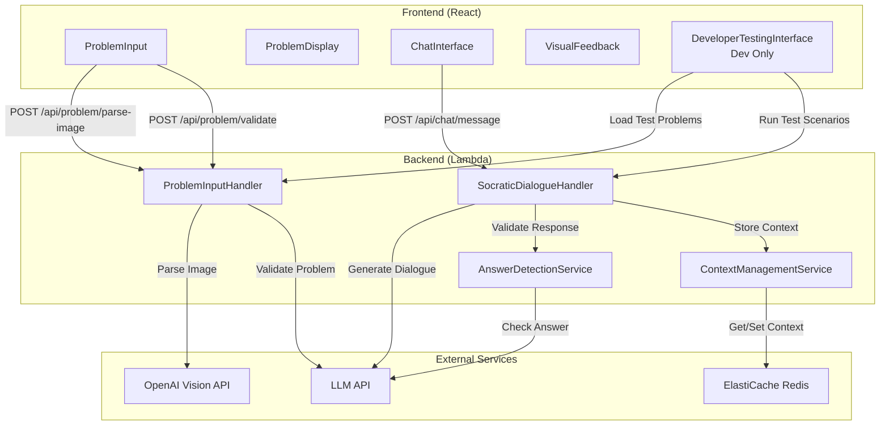

# Components

### Frontend Components

#### ProblemInput Component

**Responsibility:** Handles problem input via text entry and image upload

**Key Interfaces:**
- `onProblemSubmit(problem: Problem): void` - Callback when problem is submitted
- `onImageUpload(file: File): Promise<string>` - Handles image upload and parsing

**Dependencies:** API client service for image parsing and problem validation

**Technology Stack:** React + TypeScript, Tailwind CSS, File API

#### ProblemDisplay Component

**Responsibility:** Displays current problem on left side of interface with math rendering

**Key Interfaces:**
- `problem: Problem | null` - Current problem to display
- `onNewProblem(): void` - Callback to start new problem

**Dependencies:** KaTeX for math rendering

**Technology Stack:** React + TypeScript, KaTeX, Tailwind CSS

#### ChatInterface Component

**Responsibility:** Displays conversation messages and handles user input

**Key Interfaces:**
- `messages: Message[]` - Conversation messages
- `onMessageSend(message: string): void` - Callback when user sends message
- `sessionId: string` - Current session identifier

**Dependencies:** API client service for chat messages

**Technology Stack:** React + TypeScript, Tailwind CSS

#### VisualFeedback Component

**Responsibility:** Displays age-appropriate visual feedback (progress indicators, encouragement) for 6th grade students (ages 11-12)

**Key Interfaces:**
- `progress: number` - Progress indicator value
- `encouragement: string | null` - Encouraging message to display
- `helpLevel: number` - Current help escalation level

**Dependencies:** None (self-contained)

**Technology Stack:** React + TypeScript, Tailwind CSS, simple animations

#### DeveloperTestingInterface Component (Development Only)

**Responsibility:** Provides streamlined testing interface for developers to test different problem types, scenarios, and edge cases

**Key Interfaces:**
- `loadTestProblem(problemType: ProblemType, scenario: string): void` - Load test problem from fixtures
- `runScenarioTest(scenario: TestScenario): Promise<TestResult>` - Run specific scenario test
- `runBatchTests(scenarios: TestScenario[]): Promise<BatchTestResult>` - Run multiple scenarios in batch
- `showTestResults(results: TestResult[]): void` - Display test results dashboard

**Dependencies:** Test fixtures, test utilities, API client for testing endpoints

**Technology Stack:** React + TypeScript, Tailwind CSS

**Access Control:** Only accessible in development environment (`NODE_ENV=development`), hidden in production builds

### Backend Components

#### ProblemInputHandler Lambda

**Responsibility:** Processes text input and image uploads, validates problems

**Key Interfaces:**
- `POST /api/problem/parse-image` - Image parsing endpoint
- `POST /api/problem/validate` - Problem validation endpoint

**Dependencies:** OpenAI Vision API client, LLM API client for validation

**Technology Stack:** Node.js + TypeScript, Express, AWS Lambda

#### SocraticDialogueHandler Lambda

**Responsibility:** Generates Socratic dialogue responses using LLM

**Key Interfaces:**
- `POST /api/chat/message` - Chat message endpoint

**Dependencies:** LLM API client, Context management service, Answer detection service

**Technology Stack:** Node.js + TypeScript, Express, AWS Lambda

#### AnswerDetectionService

**Responsibility:** Two-tier answer detection guardrails (keyword + LLM validation)

**Key Interfaces:**
- `detectAnswer(response: string): Promise<DetectionResult>` - Checks for direct answers

**Dependencies:** LLM API client for validation

**Technology Stack:** Node.js + TypeScript

#### ContextManagementService

**Responsibility:** Manages session context (last 10 messages + problem state)

**Key Interfaces:**
- `getContext(sessionId: string): Promise<Session>` - Retrieve session context
- `addMessage(sessionId: string, message: Message): Promise<void>` - Add message to context
- `setProblem(sessionId: string, problem: Problem): Promise<void>` - Set current problem

**Dependencies:** Redis client (ElastiCache)

**Technology Stack:** Node.js + TypeScript, Redis client

#### TestingService (Development Only)

**Responsibility:** Provides testing utilities and endpoints for streamlined testing workflows

**Key Interfaces:**
- `GET /api/dev/test-fixtures` - Retrieve test problem fixtures organized by problem type
- `POST /api/dev/run-scenario` - Run specific test scenario programmatically
- `POST /api/dev/run-batch` - Run batch of test scenarios
- `GET /api/dev/test-results` - Retrieve test results and metrics

**Dependencies:** Test fixtures, test utilities, answer detection service

**Technology Stack:** Node.js + TypeScript, Express, AWS Lambda

**Access Control:** Only accessible in development environment, disabled in production

### Component Diagram


