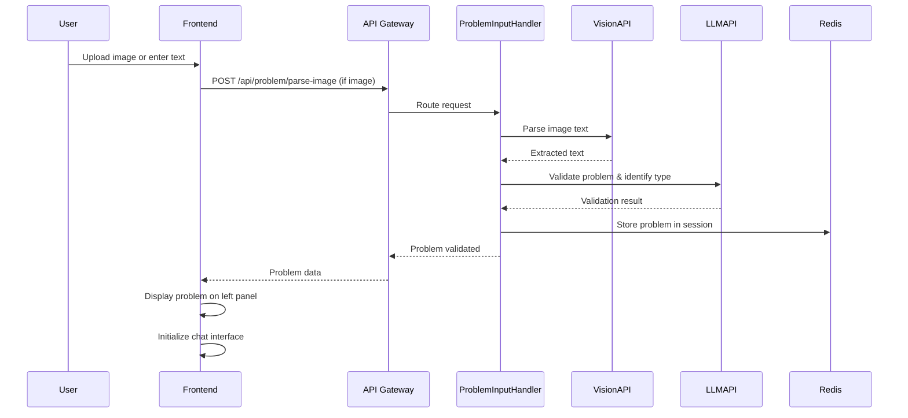
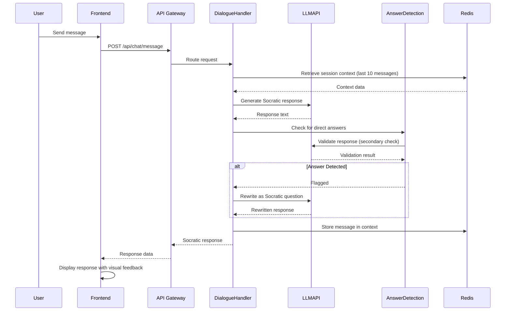

# Core Workflows

### Problem Submission Workflow

```mermaid
sequenceDiagram
    participant User
    participant Frontend
    participant API Gateway
    participant ProblemInputHandler
    participant VisionAPI
    participant LLMAPI
    participant Redis

    User->>Frontend: Upload image or enter text
    Frontend->>API Gateway: POST /api/problem/parse-image (if image)
    API Gateway->>ProblemInputHandler: Route request
    ProblemInputHandler->>VisionAPI: Parse image text
    VisionAPI-->>ProblemInputHandler: Extracted text
    ProblemInputHandler->>LLMAPI: Validate problem & identify type
    LLMAPI-->>ProblemInputHandler: Validation result
    ProblemInputHandler->>Redis: Store problem in session
    ProblemInputHandler-->>API Gateway: Problem validated
    API Gateway-->>Frontend: Problem data
    Frontend->>Frontend: Display problem on left panel
    Frontend->>Frontend: Initialize chat interface
```

### Socratic Dialogue Workflow

```mermaid
sequenceDiagram
    participant User
    participant Frontend
    participant API Gateway
    participant DialogueHandler
    participant LLMAPI
    participant AnswerDetection
    participant Redis

    User->>Frontend: Send message
    Frontend->>API Gateway: POST /api/chat/message
    API Gateway->>DialogueHandler: Route request
    DialogueHandler->>Redis: Retrieve session context (last 10 messages)
    Redis-->>DialogueHandler: Context data
    DialogueHandler->>LLMAPI: Generate Socratic response
    LLMAPI-->>DialogueHandler: Response text
    DialogueHandler->>AnswerDetection: Check for direct answers
    AnswerDetection->>LLMAPI: Validate response (secondary check)
    LLMAPI-->>AnswerDetection: Validation result
    alt Answer Detected
        AnswerDetection-->>DialogueHandler: Flagged
        DialogueHandler->>LLMAPI: Rewrite as Socratic question
        LLMAPI-->>DialogueHandler: Rewritten response
    end
    DialogueHandler->>Redis: Store message in context
    DialogueHandler-->>API Gateway: Socratic response
    API Gateway-->>Frontend: Response data
    Frontend->>Frontend: Display response with visual feedback
```
