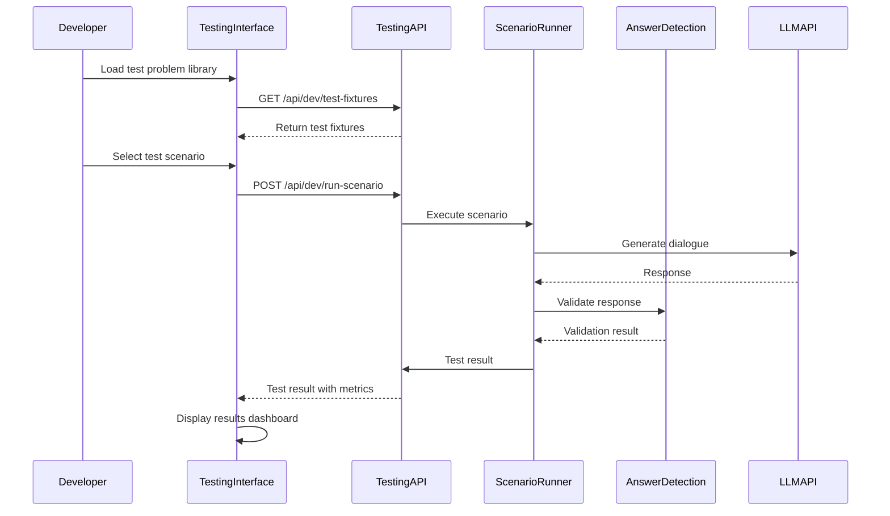

# Developer Testing Interface Architecture

### Overview

The Developer Testing Interface is a comprehensive testing infrastructure designed to streamline testing workflows and enable rapid validation of system behavior across all problem types and edge cases. This interface is **development-only** and completely excluded from production builds.

### Architecture Components

**Frontend Testing Interface:**
- **Test Problem Library:** Organized by problem type (arithmetic, algebra, geometry, word problems, multi-step) with 10+ test fixtures per type
- **Scenario Testing Panel:** Interactive interface for testing specific scenarios (answer detection, progressive help escalation, context management)
- **Edge Case Testing:** Quick access to edge cases (direct answers, implicit answers, boundary conditions, error scenarios)
- **Test Results Dashboard:** Real-time visual feedback showing test results, Socratic compliance, answer detection status, and context management validation
- **Batch Testing:** Run multiple test scenarios in sequence or parallel with automated reporting

**Backend Testing Service:**
- **Test Fixtures API:** Endpoints for retrieving test problem fixtures organized by problem type
- **Scenario Runner:** Programmatic execution of test scenarios with validation
- **Test Validator:** Validates test results, Socratic compliance, answer detection accuracy
- **Batch Test Executor:** Executes multiple test scenarios with parallel processing support

### Testing Workflow



### Test Fixture Structure

**Test Fixtures Organization:**
- **50+ Test Scenarios:** Minimum 10 scenarios per problem type (arithmetic, algebra, geometry, word problems, multi-step)
- **Edge Case Coverage:** Direct answer detection, implicit answer detection, boundary conditions, error scenarios
- **Expected Behavior:** Each fixture includes expected Socratic steps, must-not-contain patterns, and validation criteria

**Example Test Fixture:**
```typescript
// tests/fixtures/problems/arithmetic.fixtures.ts
export const arithmeticProblems = {
  basicAddition: {
    id: 'arithmetic-basic-addition-1',
    name: 'Basic Addition',
    problemType: 'arithmetic',
    problem: {
      text: 'What is 15 + 27?',
      type: 'arithmetic',
      source: 'text',
    },
    expectedSteps: [
      'What operation are we performing?',
      'What is 15 + 20?',
      'What is 35 + 7?',
    ],
    mustNotContain: ['42', 'the answer is', 'equals'],
    validationCriteria: {
      socraticCompliance: 100,
      answerDetected: false,
      maxTurns: 10,
    },
  },
  // ... more arithmetic problems
};
```

### Real-Time Testing Indicators

**Visual Feedback During Testing:**
- **Answer Detection Status:** Shows keyword detection and LLM validation results in real-time
- **Socratic Compliance:** Percentage indicator (100% required) with pass/fail status
- **Context Management Status:** Visual representation of session state, message history, and context retention
- **Help Escalation Level:** Current help level and escalation triggers
- **Test Execution Progress:** Progress bar for batch tests showing completion status

### Batch Testing Capabilities

**Batch Test Execution:**
- **Parallel Processing:** Run multiple test scenarios in parallel for faster execution
- **Sequential Processing:** Run scenarios sequentially for dependency testing
- **Selective Execution:** Run specific problem types or scenario categories
- **Automated Reporting:** Generate comprehensive test reports with metrics and compliance validation

**Batch Test Results:**
- Total scenarios run
- Pass/fail counts
- Socratic compliance rate (aggregate across all scenarios)
- Answer detection accuracy
- Context management validation
- Performance metrics (execution time, response times)

