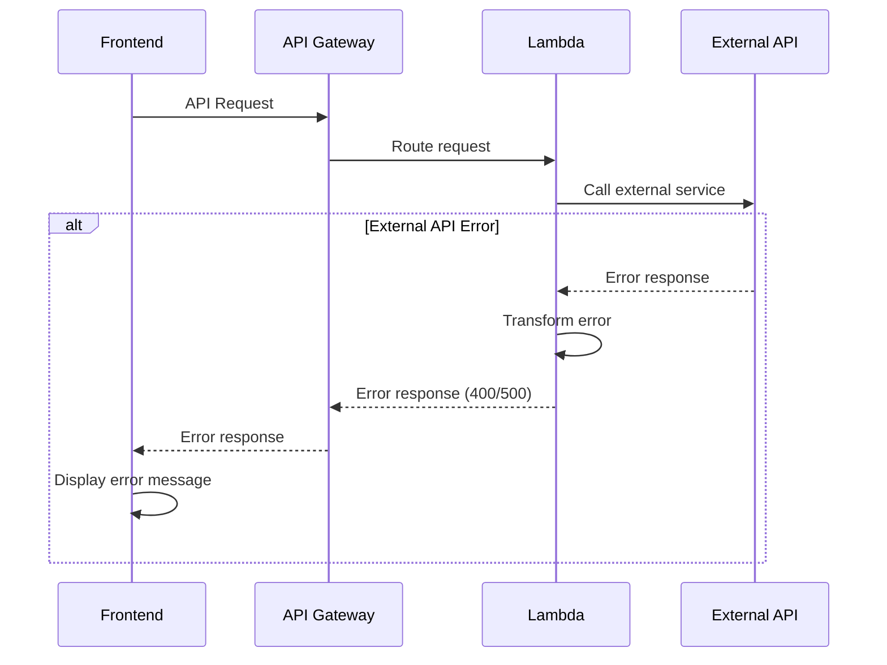

# Error Handling Strategy

### Error Flow



### Error Response Format

```typescript
interface ApiError {
  error: {
    code: string;
    message: string;
    details?: Record<string, any>;
    timestamp: string;
    requestId: string;
  };
}
```

### Frontend Error Handling

```typescript
// apps/web/src/services/api/client.ts
apiClient.interceptors.response.use(
  response => response,
  error => {
    if (error.response) {
      // Server responded with error
      const apiError = error.response.data as ApiError;
      // Display user-friendly error message
      showError(apiError.error.message);
    } else if (error.request) {
      // Request made but no response
      showError('Network error. Please check your connection.');
    } else {
      // Something else happened
      showError('An unexpected error occurred.');
    }
    return Promise.reject(error);
  }
);
```

### Backend Error Handling

```typescript
// apps/api/src/middleware/errorHandler.ts
export const errorHandler = (error: any): APIGatewayProxyResult => {
  const errorCode = error.code || 'INTERNAL_ERROR';
  const statusCode = error.statusCode || 500;
  const message = error.message || 'An unexpected error occurred';

  return {
    statusCode,
    headers: {
      'Content-Type': 'application/json',
      'Access-Control-Allow-Origin': '*',
    },
    body: JSON.stringify({
      error: {
        code: errorCode,
        message,
        timestamp: new Date().toISOString(),
        requestId: context?.awsRequestId || 'unknown',
      },
    }),
  };
};
```
