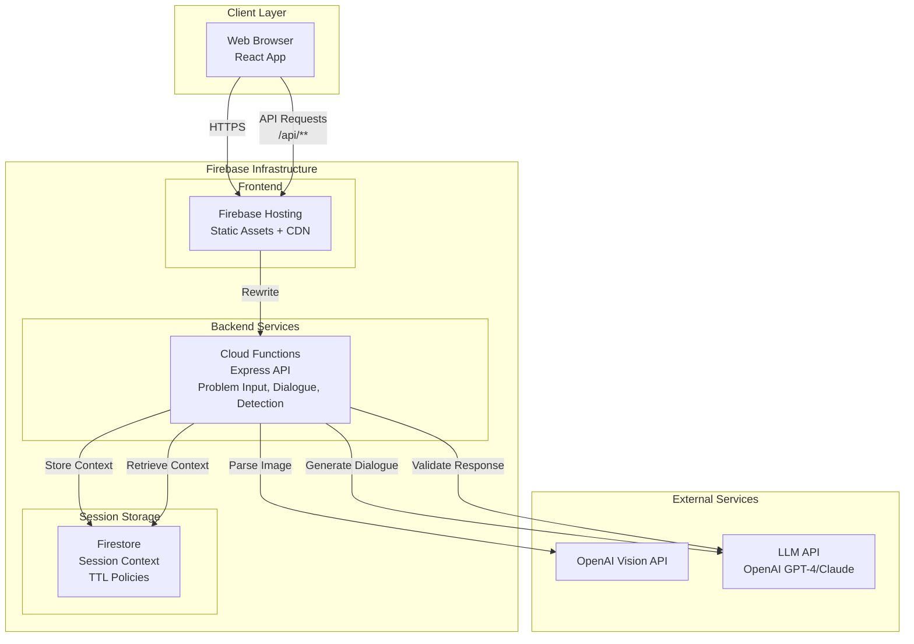

# High Level Architecture

### Technical Summary

AI Math Tutor uses a serverless fullstack architecture with Firebase Cloud Functions for backend API endpoints, paired with a React frontend deployed as static assets. The system follows a monorepo structure combining frontend and backend TypeScript code in a single repository, enabling shared types and utilities across the stack. The architecture leverages Firebase services (Hosting, Cloud Functions, Firestore) for scalable, cost-effective deployment while maintaining clean separation between frontend UI, backend API services, and session management. The system integrates with OpenAI Vision API for image parsing and LLM APIs (OpenAI GPT-4 or Claude) for Socratic dialogue generation, with enforced answer detection guardrails ensuring pedagogical quality. The system is specifically designed for 6th grade mathematics (ages 11-12), focusing on core 6th grade math topics including operations with fractions and decimals, ratios and proportions, integers, introductory algebra, basic geometry, and multi-step word problems. A developer testing interface (development-only) enables streamlined testing workflows for rapid validation across all problem types and edge cases. This serverless approach provides the scalability and cost-effectiveness needed for an MVP while supporting the requirement for sub-3-second LLM response times and maintaining conversation context across 10+ message exchanges.

### Platform and Infrastructure Choice

**Platform:** Firebase Full Stack

**Key Services:**

- **Frontend:** Firebase Hosting with global CDN distribution
- **Backend:** Firebase Cloud Functions (serverless) for API endpoints with Express app integration
- **Session Storage:** Firestore for session management (last 10 messages) with TTL policies
- **API Routing:** Firebase Hosting rewrites for API routing, connecting frontend to Cloud Functions
- **CDN:** Firebase Hosting global CDN for static asset delivery and edge caching

**Deployment Host and Regions:**

- Primary: us-central1 (Firebase Cloud Functions region)
- CDN: Firebase Hosting global distribution

**Rationale:**
Firebase provides integrated serverless architecture with unified deployment:

- **Cost-effectiveness for MVP:** Pay-per-use model ideal for initial deployment
- **Scalability:** Auto-scaling Cloud Functions handle variable load
- **Integration:** Seamless integration between Hosting, Functions, and Firestore
- **Session Management:** Firestore provides fast storage for session context (last 10 messages) with TTL policies for automatic cleanup
- **Unified Deployment:** Single CLI tool (Firebase CLI) for deploying functions, hosting, and database
- **Local Development:** Firebase emulators provide local testing environment

### Repository Structure

**Structure:** Monorepo

**Monorepo Tool:** npm workspaces (lightweight, no additional tooling required)

**Package Organization:**

- Root package.json manages workspace dependencies
- `apps/web/` - React frontend application
- `apps/api/` - Node.js/Express backend API
- `packages/shared/` - Shared TypeScript types and utilities
- `packages/config/` - Shared ESLint, TypeScript, Jest configurations

**Rationale:**
The PRD explicitly requires a monorepo structure. npm workspaces provides:

- Simple setup without additional tooling complexity
- Shared TypeScript types between frontend and backend
- Unified dependency management
- Easier context management across the stack
- Aligns with 3-day MVP timeline (minimal tooling overhead)

### High Level Architecture Diagram

### Architectural Patterns

- **Serverless Architecture:** Backend deployed as Firebase Cloud Functions - _Rationale:_ Cost-effective for MVP, auto-scaling, pay-per-use model, eliminates server management overhead

- **Jamstack Architecture:** Static frontend with serverless APIs - _Rationale:_ Optimal performance through static asset delivery via Firebase Hosting CDN, reduced backend load, improved security

- **Component-Based UI:** React functional components with TypeScript - _Rationale:_ Maintainability, reusability, type safety across UI components, aligns with modern React best practices

- **Repository Pattern:** Abstract data access for session management - _Rationale:_ Enables testing with mock implementations, future flexibility for storage backend changes

- **Firebase Hosting Rewrites:** API routing via Firebase Hosting rewrites - _Rationale:_ Unified deployment, seamless integration between frontend and backend, automatic SSL and CDN distribution

- **Two-Tier Guardrail Pattern:** Keyword-based + LLM-based answer detection - _Rationale:_ Defense in depth approach ensures 100% Socratic compliance, catches both explicit and implicit answers

- **Progressive Help Escalation:** Context-aware hint generation - _Rationale:_ Maintains pedagogical quality while adapting to student needs, prevents student abandonment

- **Session-Based Context Management:** In-memory storage of last 10 messages - _Rationale:_ Fast access, no persistence requirements per PRD, cost-effective for anonymous sessions
