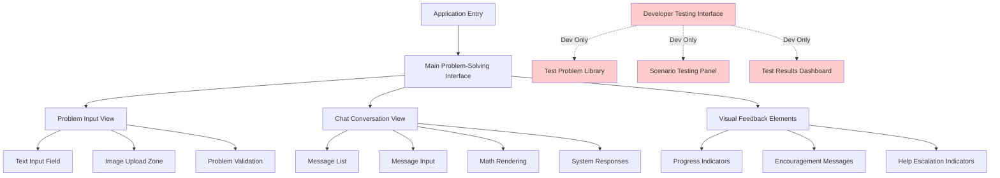
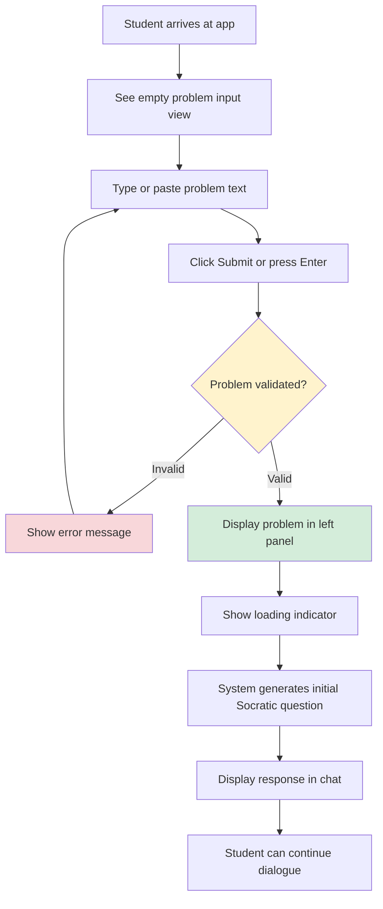
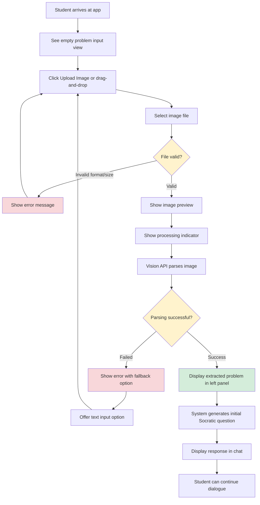
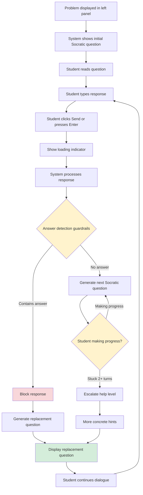
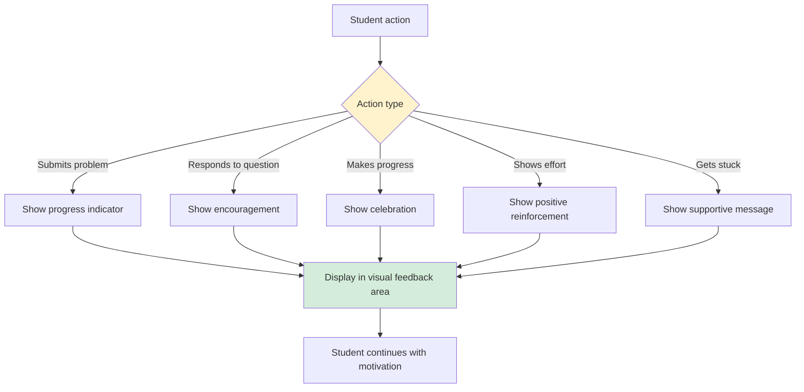

# AI Math Tutor UI/UX Specification

## Introduction

This document defines the user experience goals, information architecture, user flows, and visual design specifications for AI Math Tutor's user interface. It serves as the foundation for visual design and frontend development, ensuring a cohesive and user-centered experience.

### Overall UX Goals & Principles

#### Target User Personas

**Primary User: 6th Grade Student (Ages 11-12)**

- **Demographic:** 11-12 year old students learning 6th grade mathematics
- **Technical Ability:** Comfortable with web browsers, basic typing skills, familiar with mobile/tablet interfaces
- **Learning Context:** Working on homework, practice problems, or seeking help with math concepts
- **Motivation:** Wants to understand math concepts and solve problems independently, but may feel frustrated when stuck
- **Needs:**
  - Patient, encouraging guidance that doesn't give away answers
  - Visual feedback that celebrates progress and effort
  - Age-appropriate language and visual elements
  - Clear, simple interface that doesn't overwhelm
  - Responsive design that works on devices they have available (tablet, laptop, mobile)

**Secondary User: Developer (Development Environment Only)**

- **Context:** Testing and validating system behavior during development
- **Needs:** Efficient testing interface with quick access to test problems, edge case scenarios, and real-time validation indicators
- **Access:** Development environment only, hidden in production

#### Usability Goals

1. **Ease of Learning:** New students can submit a problem and start receiving guidance within 30 seconds
2. **Efficiency of Use:** Students can input problems via text or image with minimal friction
3. **Error Prevention:** Clear validation and helpful error messages prevent confusion
4. **Memorability:** Interface layout is intuitive enough that returning students don't need to relearn navigation
5. **Engagement:** Visual feedback and encouragement maintain student motivation throughout problem-solving
6. **Accessibility:** Interface is usable by students with different learning needs and abilities

#### Design Principles

1. **Clarity over Complexity** - Prioritize clear communication and simple interactions over feature-rich complexity
2. **Progressive Disclosure** - Show only what's needed when it's needed; hints become more concrete only after multiple attempts
3. **Immediate Feedback** - Every action should have clear, immediate visual response appropriate for the age group
4. **Visual Engagement** - Use colors, icons, and simple animations to celebrate progress and maintain engagement
5. **Accessible by Default** - Design for all users from the start, meeting WCAG AA standards
6. **Problem-Centric Layout** - Keep the problem visible at all times while facilitating dialogue
7. **Encouragement First** - Visual feedback should feel warm, supportive, and age-appropriate

### Change Log

| Date       | Version | Description                               | Author    |
| ---------- | ------- | ----------------------------------------- | --------- |
| 2025-01-XX | 1.0     | Initial UX/Frontend specification created | UX Expert |

## Information Architecture (IA)

### Site Map / Screen Inventory

**Note:** The developer testing interface (shown in red) is only accessible in development environment and hidden in production builds.

### Navigation Structure

**Primary Navigation:** None - Single-page application with no navigation menus required

The application is a single-page application focused on the problem-solving interface. There is no traditional navigation menu, as users remain on the main interface throughout their session.

**Secondary Navigation:** None - No secondary navigation required

**Breadcrumb Strategy:** Not applicable - Single-page application with no hierarchical navigation

**Problem State Management:**

- Students can start a new problem at any time by clearing the current problem
- The interface maintains state for the current problem and conversation history
- No navigation between different sections is required

## User Flows

### Flow 1: Submit Problem via Text Input

**User Goal:** Submit a math problem by typing or pasting text to begin receiving Socratic guidance

**Entry Points:**

- Initial application load (empty state)
- After completing a previous problem
- After clearing current problem

**Success Criteria:**

- Problem text is successfully submitted and validated
- Problem is displayed in the left panel
- System responds with initial Socratic question
- Student can begin dialogue

**Flow Diagram:**

**Edge Cases & Error Handling:**

- Empty input → Show validation error: "Please enter a math problem"
- Non-math content → Show error: "This doesn't look like a math problem. Please try again with a math question."
- API failure → Show error: "Oops! Something went wrong. Please try again."
- Network error → Show error: "Check your internet connection and try again."

**Notes:**

- Text input should support multi-line input for longer problems
- Paste functionality should handle formatted text from other sources
- Validation happens on backend, but frontend can provide immediate feedback for empty input

### Flow 2: Submit Problem via Image Upload

**User Goal:** Submit a math problem by uploading an image containing printed text

**Entry Points:**

- Initial application load (empty state)
- After completing a previous problem
- After clearing current problem
- Alternative to text input when problem is in a book or worksheet

**Success Criteria:**

- Image is successfully uploaded and processed
- Problem text is extracted from image
- Problem is displayed in the left panel
- System responds with initial Socratic question
- Student can begin dialogue

**Flow Diagram:**

**Edge Cases & Error Handling:**

- Invalid file format → Show error: "Please upload a JPG, PNG, or GIF image"
- File too large → Show error: "Image is too large. Please use an image under 10MB"
- Vision API parsing failure → Show error: "Couldn't read the problem from your image. Try typing it instead or upload a clearer image."
- Network error → Show error: "Check your internet connection and try again."
- Blurry or unclear image → Offer text input fallback

**Notes:**

- Support drag-and-drop for better UX
- Show image preview before processing
- Provide clear visual feedback during processing (loading spinner)
- Always offer text input as fallback option

### Flow 3: Engage in Socratic Dialogue

**User Goal:** Work through the problem step-by-step with guided Socratic questioning

**Entry Points:**

- After problem is submitted and initial question is received
- Continuation of ongoing dialogue

**Success Criteria:**

- Student can respond to guiding questions
- System provides appropriate next question based on response
- Conversation context is maintained across multiple turns
- Student makes progress toward solution
- System never provides direct answers

**Flow Diagram:**

**Edge Cases & Error Handling:**

- Empty response → Prompt: "I'd love to hear your thoughts! Try typing what you're thinking."
- LLM API failure → Show error: "Oops! Something went wrong. Please try again."
- Response timeout → Show error: "This is taking longer than usual. Please try again."
- Context loss → System should gracefully handle session expiration

**Notes:**

- Maintain last 10 messages in conversation context
- Visual feedback should celebrate progress and effort
- Help escalation should maintain Socratic principles (never give direct answers)
- Progress indicators should show advancement through problem-solving process

### Flow 4: Receive Visual Feedback and Encouragement

**User Goal:** Feel supported and motivated through visual feedback and encouragement

**Entry Points:**

- Throughout the problem-solving process
- After each student response
- When making progress or showing effort

**Success Criteria:**

- Visual feedback appears immediately after actions
- Encouragement feels age-appropriate and supportive
- Progress indicators show advancement
- Students feel motivated to continue

**Flow Diagram:**

**Edge Cases & Error Handling:**

- Feedback should be subtle and not distracting
- Should not interfere with problem display or dialogue
- Should be dismissible or fade after appropriate time

**Notes:**

- Visual feedback should be age-appropriate (emojis, colors, simple animations)
- Should feel warm and supportive, not condescending
- Progress indicators should show advancement without revealing answers

## Wireframes & Mockups

### Design Files

**Primary Design Files:** Design files will be created in Figma (or similar design tool) based on this specification. The design system will follow the specifications outlined in this document.

**Design File Structure:**

- Main Problem-Solving Interface
- Problem Input Components
- Chat Conversation Components
- Visual Feedback Components
- Responsive Breakpoints (Desktop, Tablet, Mobile)
- Developer Testing Interface (Development Only)

### Key Screen Layouts

#### Screen 1: Main Problem-Solving Interface

**Purpose:** Primary interface where students solve math problems with Socratic guidance

**Key Elements:**

- **Left Panel (Problem Display):**
  - Problem statement with LaTeX/KaTeX rendering
  - Problem type badge (Arithmetic, Algebra, Geometry, Word Problem, Multi-step)
  - Clear visual boundary from chat panel
- **Right Panel (Chat Conversation):**
  - Message list with student and system messages
  - Message input field at bottom
  - Send button
  - Math rendering for equations in messages
- **Visual Feedback Area:**
  - Progress indicators (top of interface or integrated with chat)
  - Encouragement messages
  - Help escalation indicators
- **Problem Input (when no problem active):**
  - Text input field
  - Image upload button/drop zone
  - Submit button

**Interaction Notes:**

- Side-by-side layout maintains problem visibility throughout dialogue
- Chat auto-scrolls to latest message
- Visual feedback appears contextually (not blocking main content)
- Responsive design adapts to screen size (stacks on mobile)

**Design File Reference:** TBD - To be created in Figma

#### Screen 2: Problem Input View (Empty State)

**Purpose:** Initial state when student first arrives or wants to start a new problem

**Key Elements:**

- Welcome message or instructions
- Text input field (large, prominent)
- Image upload button/drop zone (prominent, clear visual)
- Helper text: "Type your problem or upload an image"
- Visual indicators for supported image formats

**Interaction Notes:**

- Clear call-to-action for both input methods
- Drag-and-drop zone should be visually obvious
- Input validation provides immediate feedback

**Design File Reference:** TBD - To be created in Figma

#### Screen 3: Chat Conversation View

**Purpose:** Display Socratic dialogue between student and system

**Key Elements:**

- Message bubbles (student messages: right-aligned, system messages: left-aligned)
- Math rendering within messages (LaTeX/KaTeX)
- Timestamp or visual separation between message groups
- Loading indicator when system is generating response
- Message input field with send button
- Auto-scroll to latest message

**Interaction Notes:**

- Messages should be clearly distinguished (different styling, alignment)
- Math equations should render clearly and be readable
- Long messages should wrap appropriately
- Keyboard navigation should work smoothly

**Design File Reference:** TBD - To be created in Figma

#### Screen 4: Visual Feedback Elements

**Purpose:** Provide encouragement and progress indicators throughout the experience

**Key Elements:**

- Progress indicators (steps, progress bar, or milestone markers)
- Encouragement messages with emojis or icons
- Celebration animations for progress milestones
- Help escalation indicators (subtle, not alarming)

**Interaction Notes:**

- Should not block or distract from main content
- Should feel warm and age-appropriate
- Should be dismissible or fade after appropriate time
- Should celebrate effort, not just correct answers

**Design File Reference:** TBD - To be created in Figma

#### Screen 5: Developer Testing Interface (Development Only)

**Purpose:** Enable efficient testing of different problem types, scenarios, and edge cases

**Key Elements:**

- Test problem library (organized by problem type)
- One-click problem loading
- Scenario testing panel
- Real-time testing indicators (answer detection status, Socratic compliance, context management)
- Test results dashboard
- Batch testing controls

**Interaction Notes:**

- Should be accessible only in development environment
- Should be intuitive for developers to use
- Should provide immediate visual feedback on test results
- Should support rapid iteration and testing

**Design File Reference:** TBD - To be created in Figma (development only)

## Component Library / Design System

### Design System Approach

**Approach:** Custom design system built with Tailwind CSS v4.1.16

Since the PRD specifies Tailwind CSS v4.1.16 and no existing design system is mentioned, we will create a custom design system using Tailwind's utility-first approach. This provides:

- **Flexibility:** Complete control over design tokens and components
- **Consistency:** Tailwind's utility classes ensure consistent styling
- **Performance:** Utility-first approach minimizes CSS bundle size
- **Maintainability:** Design tokens can be customized in Tailwind config

**Design Tokens:**

- Colors: Defined in Tailwind config for age-appropriate palette
- Typography: Defined in Tailwind config with appropriate font sizes and weights
- Spacing: Using Tailwind's default spacing scale
- Border radius: Using Tailwind's default radius scale
- Shadows: Custom shadows for depth and elevation

### Core Components

#### Component 1: Problem Display Panel

**Purpose:** Display the current math problem in the left panel with proper math rendering

**Variants:**

- Default: Standard problem display
- Empty state: When no problem is active
- Loading state: When problem is being processed

**States:**

- Empty: No problem displayed, shows input options
- Loading: Problem being validated or processed
- Active: Problem displayed with type badge
- Error: Error message displayed with retry option

**Usage Guidelines:**

- Always visible in left panel (or top on mobile)
- Problem text should be clearly readable with appropriate font size
- Math equations render using LaTeX/KaTeX
- Problem type badge should be subtle but visible
- Should handle long problem statements gracefully (scroll if needed)

#### Component 2: Chat Message List

**Purpose:** Display conversation history between student and system

**Variants:**

- Student message: Right-aligned, distinct styling
- System message: Left-aligned, distinct styling
- Loading message: Shows loading indicator while system generates response

**States:**

- Empty: No messages yet
- Loading: System response being generated
- Active: Messages displayed with proper formatting
- Error: Error message displayed

**Usage Guidelines:**

- Messages should be clearly distinguished by alignment and styling
- Math equations within messages should render properly
- Long messages should wrap appropriately
- Auto-scroll to latest message
- Should handle 10+ messages gracefully (scroll container)

#### Component 3: Message Input Field

**Purpose:** Allow students to type and submit responses

**Variants:**

- Default: Standard text input
- Disabled: When system is processing or error state

**States:**

- Default: Ready for input
- Focused: Active input state
- Disabled: Cannot input (during processing)
- Error: Validation error displayed

**Usage Guidelines:**

- Should support multi-line input for longer responses
- Should have clear send button or Enter key submission
- Should provide visual feedback during submission
- Should be accessible via keyboard navigation

#### Component 4: Image Upload Component

**Purpose:** Allow students to upload images containing math problems

**Variants:**

- Button: Standard upload button
- Drop zone: Drag-and-drop area

**States:**

- Default: Ready for upload
- Hover: Visual feedback on hover
- Dragging: Visual feedback when dragging file over
- Uploading: Loading indicator during upload
- Success: Image preview displayed
- Error: Error message displayed

**Usage Guidelines:**

- Should support both click-to-upload and drag-and-drop
- Should validate file format and size before upload
- Should show image preview after selection
- Should provide clear error messages for invalid files
- Should be accessible via keyboard navigation

#### Component 5: Progress Indicator

**Purpose:** Show student advancement through problem-solving process

**Variants:**

- Steps: Step-by-step progress indicators
- Progress bar: Visual progress bar
- Milestone markers: Visual milestone celebrations

**States:**

- Initial: Starting state
- In progress: Active progress indication
- Milestone reached: Celebration animation
- Complete: Problem solved (if applicable)

**Usage Guidelines:**

- Should be age-appropriate (colors, simple animations)
- Should not reveal answers or solution steps
- Should celebrate effort and progress, not just correct answers
- Should be subtle and not distracting

#### Component 6: Encouragement Message

**Purpose:** Provide positive reinforcement and motivation

**Variants:**

- General encouragement: "Great thinking!"
- Progress celebration: "You're making progress!"
- Effort recognition: "I can see you're working hard!"

**States:**

- Displaying: Message visible with animation
- Fading: Message fading out
- Hidden: Message no longer visible

**Usage Guidelines:**

- Should feel warm and supportive
- Should use age-appropriate language
- Should include emojis or icons for visual appeal
- Should be dismissible or fade after appropriate time
- Should not block main content

#### Component 7: Math Renderer Component

**Purpose:** Render mathematical equations and formulas using LaTeX/KaTeX

**Variants:**

- Inline math: Equations within text (e.g., `$x + 5 = 10$`)
- Block math: Standalone equations (e.g., `$$\frac{a}{b} = c$$`)

**States:**

- Rendering: Equation being processed
- Rendered: Equation displayed properly
- Error: Rendering failed (fallback to raw LaTeX)

**Usage Guidelines:**

- Should automatically detect LaTeX/KaTeX syntax
- Should render in both problem display and chat messages
- Should be accessible via screen readers (appropriate ARIA labels)
- Should handle complex equations gracefully

#### Component 8: Error Message Component

**Purpose:** Display age-appropriate error messages when things go wrong

**Variants:**

- Validation error: Input validation failures
- API error: Backend API failures
- Network error: Connection issues
- Vision API error: Image parsing failures

**States:**

- Displaying: Error message visible
- Dismissible: User can dismiss error
- Actionable: Error message includes retry or alternative action

**Usage Guidelines:**

- Should use age-appropriate language (no technical jargon)
- Should provide actionable guidance (e.g., "Try again" or "Check your internet connection")
- Should use appropriate visual styling (error colors, icons)
- Should be accessible via screen readers

#### Component 9: Loading Indicator

**Purpose:** Show that the system is processing or generating a response

**Variants:**

- Spinner: Circular loading spinner
- Progress: Progress indicator for longer operations
- Skeleton: Skeleton screen for content loading

**States:**

- Active: Loading indicator visible
- Complete: Loading indicator hidden

**Usage Guidelines:**

- Should be clearly visible but not distracting
- Should provide context about what is loading (e.g., "Thinking..." or "Processing image...")
- Should have appropriate animation (smooth, not jarring)
- Should be accessible (screen reader announcements)

#### Component 10: Developer Testing Interface Components (Development Only)

**Purpose:** Enable efficient testing workflows for developers

**Variants:**

- Test problem library: List of pre-configured test problems
- Scenario testing panel: Interface for testing specific scenarios
- Test results dashboard: Visual summary of test results
- Real-time indicators: Live status of answer detection, Socratic compliance, etc.

**States:**

- Available: Component accessible in development
- Hidden: Component hidden in production

**Usage Guidelines:**

- Should be accessible only when `NODE_ENV=development`
- Should be intuitive for developers to use
- Should provide immediate visual feedback
- Should support rapid iteration and testing

## Branding & Style Guide

### Visual Identity

**Brand Guidelines:** No existing brand guidelines provided. Design should prioritize clarity, engagement, and educational effectiveness for 6th grade students (ages 11-12).

**Brand Personality:**

- **Patient and Encouraging:** Feels like working with a supportive tutor
- **Educational but Engaging:** Maintains focus on learning while being visually appealing
- **Age-Appropriate:** Designed specifically for 11-12 year olds
- **Clean and Clear:** Minimalist core with purposeful visual elements

### Color Palette

| Color Type                     | Hex Code           | Usage                                                  |
| ------------------------------ | ------------------ | ------------------------------------------------------ |
| Primary                        | #4F46E5 (Indigo)   | Primary buttons, links, key interactive elements       |
| Secondary                      | #10B981 (Emerald)  | Success states, progress indicators, positive feedback |
| Accent                         | #F59E0B (Amber)    | Highlights, encouragement elements, attention-drawing  |
| Success                        | #10B981 (Emerald)  | Success messages, correct responses (when appropriate) |
| Warning                        | #F59E0B (Amber)    | Warnings, caution messages, help escalation            |
| Error                          | #EF4444 (Red)      | Error messages, validation failures                    |
| Neutral - Text                 | #1F2937 (Gray-800) | Primary text, problem statements                       |
| Neutral - Text Secondary       | #6B7280 (Gray-500) | Secondary text, helper text                            |
| Neutral - Background           | #FFFFFF (White)    | Primary background                                     |
| Neutral - Background Secondary | #F9FAFB (Gray-50)  | Secondary background, chat message backgrounds         |
| Neutral - Border               | #E5E7EB (Gray-200) | Borders, dividers                                      |

**Rationale:**

- **Primary (Indigo):** Professional yet approachable, commonly used in educational contexts
- **Secondary (Emerald):** Positive, growth-oriented, good for progress and success
- **Accent (Amber):** Warm, attention-grabbing, good for encouragement without being alarming
- **Neutral Palette:** Provides good contrast and readability while maintaining clean aesthetic

### Typography

#### Font Families

- **Primary:** Inter or System Font Stack (sans-serif) - Modern, readable, widely available
- **Secondary:** System Font Stack - Fallback for optimal performance
- **Monospace:** 'Courier New', monospace - For code or technical content (if needed)

**Rationale:** System fonts ensure fast loading and optimal readability. Inter is a modern, friendly sans-serif that works well for educational content.

#### Type Scale

| Element | Size            | Weight          | Line Height | Usage                                      |
| ------- | --------------- | --------------- | ----------- | ------------------------------------------ |
| H1      | 2rem (32px)     | 700 (Bold)      | 1.2         | Page titles (if needed)                    |
| H2      | 1.5rem (24px)   | 600 (Semi-bold) | 1.3         | Section headers                            |
| H3      | 1.25rem (20px)  | 600 (Semi-bold) | 1.4         | Subsection headers                         |
| Body    | 1rem (16px)     | 400 (Regular)   | 1.5         | Primary text, problem statements, messages |
| Small   | 0.875rem (14px) | 400 (Regular)   | 1.5         | Helper text, labels, secondary information |
| Math    | 1rem (16px)     | 400 (Regular)   | 1.5         | Mathematical equations (KaTeX rendering)   |

**Rationale:**

- Body text at 16px ensures good readability for the target age group
- Line height of 1.5 provides comfortable reading experience
- Weight hierarchy (400/600/700) creates clear visual hierarchy without being overwhelming

### Iconography

**Icon Library:** Heroicons or similar simple, clear icon set

**Usage Guidelines:**

- Use icons sparingly to avoid visual clutter
- Icons should be simple and clear, appropriate for 6th grade students
- Use icons to enhance understanding, not replace text
- Icons should be accessible (appropriate ARIA labels)
- Size: 20px-24px for standard icons, larger for emphasis

**Common Icons:**

- Upload icon: For image upload button
- Send icon: For message send button
- Check icon: For success states
- X icon: For error states or dismiss actions
- Lightbulb icon: For hints or help
- Star icon: For encouragement or milestones

### Spacing & Layout

**Grid System:** Flexible layout using CSS Grid and Flexbox (no strict grid system required for MVP)

**Spacing Scale:** Using Tailwind's default spacing scale:

- 0.25rem (4px) - xs
- 0.5rem (8px) - sm
- 1rem (16px) - base
- 1.5rem (24px) - lg
- 2rem (32px) - xl
- 3rem (48px) - 2xl
- 4rem (64px) - 3xl

**Layout Principles:**

- Side-by-side layout: 50/50 split on desktop, stacks on mobile
- Generous white space: Prevents visual clutter, maintains focus
- Consistent padding: 1rem-1.5rem for component padding
- Clear visual boundaries: Use borders or background colors to separate panels

## Accessibility Requirements

### Compliance Target

**Standard:** WCAG AA (Web Content Accessibility Guidelines Level AA)

**Rationale:** WCAG AA is the standard specified in the PRD and provides good accessibility coverage for students with different learning needs and abilities.

### Key Requirements

#### Visual

- **Color contrast ratios:**
  - Normal text: 4.5:1 minimum (WCAG AA)
  - Large text (18px+): 3:1 minimum (WCAG AA)
  - All color combinations must meet these ratios
- **Focus indicators:**
  - Clear, visible focus indicators for all interactive elements
  - Focus indicators should be at least 2px wide
  - Use high-contrast colors for focus indicators (e.g., primary color)
- **Text sizing:**
  - Minimum 16px for body text (ensures readability)
  - Text should be resizable up to 200% without loss of functionality
  - No text in images (use actual text with proper styling)

#### Interaction

- **Keyboard navigation:**
  - All interactive elements must be accessible via keyboard (Tab, Enter, Space, Arrow keys)
  - Logical tab order throughout the interface
  - No keyboard traps (users can navigate away from any element)
  - Keyboard shortcuts should be discoverable or documented
- **Screen reader support:**
  - Proper semantic HTML (headings, landmarks, labels)
  - ARIA labels for interactive elements and complex components
  - Live regions for dynamic content updates (chat messages, progress indicators)
  - Descriptive alt text for images (where applicable)
- **Touch targets:**
  - Minimum 44x44px for touch targets (mobile/tablet)
  - Adequate spacing between touch targets to prevent accidental taps
  - Touch targets should be clearly visible and identifiable

#### Content

- **Alternative text:**
  - All images must have appropriate alt text
  - Decorative images should have empty alt text (`alt=""`)
  - Informative images should have descriptive alt text
- **Heading structure:**
  - Proper heading hierarchy (h1 → h2 → h3, no skipping levels)
  - Headings should accurately describe content sections
  - Use headings to organize content logically
- **Form labels:**
  - All form inputs must have associated labels
  - Labels should be clear and descriptive
  - Error messages should be associated with form inputs
  - Helper text should be associated with form inputs where appropriate

### Testing Strategy

**Accessibility Testing Approach:**

1. **Automated Testing:**
   - Use tools like axe DevTools or WAVE to identify common accessibility issues
   - Run automated tests during development and before deployment
2. **Manual Testing:**
   - Keyboard navigation testing (Tab through entire interface)
   - Screen reader testing (NVDA, JAWS, or VoiceOver)
   - Color contrast verification (using contrast checking tools)
   - Touch target size verification (on actual devices)
3. **User Testing:**
   - Test with students who use assistive technologies (if possible)
   - Gather feedback on accessibility from users with different needs

## Responsiveness Strategy

### Breakpoints

| Breakpoint | Min Width | Max Width | Target Devices               |
| ---------- | --------- | --------- | ---------------------------- |
| Mobile     | 320px     | 767px     | Smartphones (portrait)       |
| Tablet     | 768px     | 1023px    | Tablets (portrait/landscape) |
| Desktop    | 1024px    | 1439px    | Laptops, desktop monitors    |
| Wide       | 1440px    | -         | Large desktop monitors       |

**Rationale:**

- Mobile breakpoint covers most smartphones in portrait orientation
- Tablet breakpoint covers iPad and similar tablets
- Desktop breakpoint covers standard laptop and desktop screens
- Wide breakpoint optimizes for large monitors while maintaining readability

### Adaptation Patterns

#### Layout Changes

- **Desktop (1024px+):**
  - Side-by-side layout: Problem panel (left) and Chat panel (right), 50/50 split
  - Full horizontal space utilization
  - Generous padding and spacing
- **Tablet (768px - 1023px):**
  - Side-by-side layout maintained but with adjusted proportions (e.g., 45/55 split)
  - Slightly reduced padding to maximize content area
  - Touch-friendly interactions
- **Mobile (320px - 767px):**
  - Stacked layout: Problem panel (top) and Chat panel (bottom)
  - Full-width panels
  - Collapsible panels option (if space is tight)
  - Touch-optimized interactions

#### Navigation Changes

- **Desktop/Tablet:** No navigation menu required (single-page application)
- **Mobile:** No navigation menu required, but may need collapsible panels or tabs for better space utilization

#### Content Priority

- **Desktop:** All content visible simultaneously, generous spacing
- **Tablet:** All content visible, slightly reduced spacing
- **Mobile:** Prioritize problem and current chat, may need scroll for message history

#### Interaction Changes

- **Desktop:** Mouse and keyboard interactions
- **Tablet:** Touch interactions, larger touch targets
- **Mobile:** Touch interactions, optimized for one-handed use when possible

**Responsive Design Principles:**

- Mobile-first approach: Design for mobile, then enhance for larger screens
- Touch-friendly: All interactive elements should be easily tappable on mobile
- Readable text: Text should be readable without zooming on all devices
- Consistent experience: Core functionality works the same across all devices

## Animation & Micro-interactions

### Motion Principles

**Motion Design Philosophy:**

- **Purposeful:** Animations should serve a purpose (feedback, guidance, delight)
- **Subtle:** Animations should be subtle and not distracting from content
- **Age-Appropriate:** Animations should be engaging for 6th grade students without being overwhelming
- **Performance-First:** Animations should be smooth (60fps) and not impact performance
- **Accessible:** Respect `prefers-reduced-motion` media query for users who prefer less animation

**Animation Guidelines:**

- **Duration:** 200ms-300ms for most interactions (fast enough to feel responsive, slow enough to be perceived)
- **Easing:** Use ease-in-out for most animations (natural feeling)
- **Scale:** Subtle scale effects (1.05x-1.1x maximum) for hover/press states
- **Opacity:** Use opacity transitions for fades (0.9-1.0 range)

### Key Animations

- **Button Hover:** Subtle scale (1.05x) and color transition (200ms, ease-in-out)
- **Button Press:** Slight scale down (0.98x) for tactile feedback (100ms, ease-out)
- **Message Appearance:** Fade in with slight slide up (300ms, ease-out)
- **Loading Spinner:** Smooth rotation (1s linear, infinite)
- **Progress Indicator:** Smooth progress bar fill (500ms, ease-out)
- **Encouragement Message:** Fade in with bounce (400ms, ease-out)
- **Error Message:** Fade in with slide (300ms, ease-out)
- **Image Upload Feedback:** Fade in with scale (300ms, ease-out)

**Accessibility Consideration:**

- All animations should respect `prefers-reduced-motion: reduce`
- Use `@media (prefers-reduced-motion: reduce) { animation: none; }` to disable animations for users who prefer reduced motion

## Performance Considerations

### Performance Goals

- **Page Load:** < 3 seconds for initial load (First Contentful Paint)
- **Interaction Response:** < 100ms for UI interactions (button clicks, input changes)
- **LLM Response Time:** < 3 seconds for Socratic dialogue generation (as specified in PRD)
- **Animation FPS:** 60fps for all animations (smooth, no jank)
- **Image Processing:** Efficient image upload and processing (optimize before sending to Vision API)

### Design Strategies

**Performance Optimization Strategies:**

1. **Code Splitting:**
   - Lazy load components that aren't immediately needed
   - Split developer testing interface into separate bundle (dev-only)
2. **Asset Optimization:**
   - Optimize images before upload (client-side compression if possible)
   - Use modern image formats (WebP) when supported
   - Minimize CSS and JavaScript bundle sizes
3. **Lazy Loading:**
   - Lazy load chat message history (load older messages on scroll)
   - Lazy load math rendering (render equations as they come into view)
4. **Caching Strategy:**
   - Cache static assets (CSS, JS, images) via CloudFront
   - Cache math rendering results (if possible)
   - Cache problem validation results (if appropriate)
5. **Progressive Enhancement:**
   - Core functionality works without JavaScript (graceful degradation)
   - Enhance with JavaScript for better UX
6. **Performance Budget:**
   - Initial bundle size: < 200KB (gzipped)
   - Total page size: < 500KB (including assets)
   - Time to Interactive: < 3 seconds

## Next Steps

### Immediate Actions

1. **Review with Stakeholders:**
   - Review this specification with product team and stakeholders
   - Gather feedback on design decisions and user experience goals
   - Validate that the specification aligns with PRD requirements

2. **Create Visual Designs:**
   - Create high-fidelity mockups in Figma (or similar design tool)
   - Design all key screens and components
   - Create responsive designs for all breakpoints
   - Design visual feedback elements and animations

3. **Prepare for Development Handoff:**
   - Share design files with development team
   - Create design tokens/theme configuration for Tailwind CSS
   - Document component specifications for developers
   - Prepare accessibility checklist for implementation

4. **User Testing Planning:**
   - Plan user testing sessions with 6th grade students (if possible)
   - Prepare test scenarios based on user flows
   - Define success criteria for user testing

5. **Design System Documentation:**
   - Document component usage guidelines
   - Create component library documentation
   - Document design tokens and styling guidelines

### Design Handoff Checklist

- [x] All user flows documented
- [x] Component inventory complete
- [x] Accessibility requirements defined
- [x] Responsive strategy clear
- [x] Brand guidelines incorporated (where applicable)
- [x] Performance goals established
- [ ] Visual designs created in design tool
- [ ] Design tokens/theme configuration prepared
- [ ] Component specifications documented for developers
- [ ] Accessibility checklist prepared for implementation
- [ ] User testing plan created

## Checklist Results

_This section will be populated after running any UI/UX validation checklists against this document._

---

**Document Status:** Complete - Ready for stakeholder review and visual design creation

**Next Action:** Create high-fidelity visual designs in Figma based on this specification
