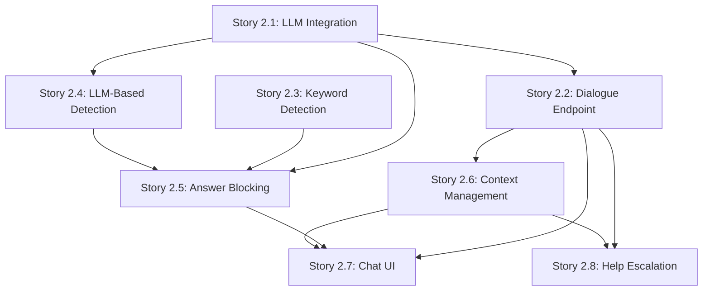

# Epic 2: Socratic Dialogue System & Answer Detection - Story Breakdown

## Overview

Epic 2 implements the core pedagogical functionality that enables students to engage in guided problem-solving through Socratic questioning. This epic includes 8 stories that build upon each other to create a complete dialogue system with guardrails.

## Story Dependencies

## Recommended Implementation Order

### Phase 1: Foundation (Stories 2.1, 2.3)

**Goal:** Establish core services for LLM integration and basic answer detection

1. **Story 2.1: LLM Integration Backend Service** ⭐ Start Here
   - Creates the foundational LLM service
   - Required by: Stories 2.2, 2.4, 2.5
   - **Dependencies:** None (can start immediately)

2. **Story 2.3: Keyword-Based Answer Detection Guardrail**
   - Creates basic answer detection patterns
   - Required by: Story 2.5
   - **Dependencies:** None (can work in parallel with 2.1)

### Phase 2: Core Dialogue (Stories 2.2, 2.4, 2.5)

**Goal:** Implement working dialogue generation with guardrails

3. **Story 2.2: Socratic Dialogue Generation Endpoint** ⭐ Critical Path
   - Creates the main API endpoint for dialogue
   - **Dependencies:** Story 2.1
   - Required by: Stories 2.6, 2.7, 2.8

4. **Story 2.4: LLM-Based Answer Detection Guardrail**
   - Adds second-tier answer detection
   - **Dependencies:** Story 2.1
   - Required by: Story 2.5

5. **Story 2.5: Answer Blocking & Response Rewriting** ⭐ Critical
   - Combines detection methods and blocks/rewrites answers
   - **Dependencies:** Stories 2.1, 2.3, 2.4
   - Required by: Story 2.7

### Phase 3: Context & UI (Stories 2.6, 2.7)

**Goal:** Enable multi-turn conversations with UI

6. **Story 2.6: Context Management Service**
   - Stores conversation history (last 10 messages)
   - **Dependencies:** Story 2.2 (needs endpoint to integrate with)
   - Required by: Stories 2.7, 2.8

7. **Story 2.7: Chat UI Component** ⭐ User-Facing
   - Creates the chat interface for students
   - **Dependencies:** Stories 2.2, 2.5, 2.6
   - **Integration Point:** Connects all previous stories into user experience

### Phase 4: Enhancement (Story 2.8)

**Goal:** Add progressive help escalation

8. **Story 2.8: Progressive Help Escalation Logic**
   - Adds adaptive help based on student progress
   - **Dependencies:** Stories 2.2, 2.6
   - **Enhancement:** Can be added after core functionality is working

## Story Summary

### Story 2.1: LLM Integration Backend Service

**Priority:** Critical  
**Complexity:** Medium  
**Dependencies:** None  
**Estimate:** 2-3 days

**What it delivers:**

- `llmService.ts` backend service module
- LLM API integration (OpenAI GPT-4, Claude, or similar)
- Secure API key management via environment variables
- Socratic dialogue prompt templates
- Error handling and rate limiting
- Provider-agnostic architecture

**Key Files:**

- `functions/src/services/llmService.ts`
- Environment configuration updates

---

### Story 2.2: Socratic Dialogue Generation Endpoint

**Priority:** Critical  
**Complexity:** Medium  
**Dependencies:** Story 2.1  
**Estimate:** 2-3 days

**What it delivers:**

- POST `/api/chat/message` endpoint
- Accepts student messages and problem context
- Generates Socratic dialogue responses
- Includes conversation history in prompts
- Returns responses with metadata (question/hint/encouragement)

**Key Files:**

- `functions/src/routes/chat.ts` (or new route file)
- `functions/src/controllers/chatController.ts`
- Integration with `llmService.ts`

---

### Story 2.3: Keyword-Based Answer Detection Guardrail

**Priority:** High  
**Complexity:** Low-Medium  
**Dependencies:** None  
**Estimate:** 1-2 days

**What it delivers:**

- `answerDetectionService.ts` (keyword-based detection)
- Pattern matching for common answer phrases
- Regex-based detection of numeric results
- Configurable pattern library
- Unit tests for detection patterns

**Key Files:**

- `functions/src/services/answerDetectionService.ts`
- `functions/src/testUtils/answerDetection.test.ts` (or similar)

**Note:** This exists as `apps/web/src/testUtils/answerDetection.ts` - may need to be moved/refactored to backend

---

### Story 2.4: LLM-Based Answer Detection Guardrail

**Priority:** High  
**Complexity:** Medium  
**Dependencies:** Story 2.1  
**Estimate:** 2-3 days

**What it delivers:**

- `answerValidationService.ts` (LLM-based validation)
- Secondary LLM call to analyze response context
- Context-aware answer detection
- Confidence scoring
- Error handling with safe defaults

**Key Files:**

- `functions/src/services/answerValidationService.ts`
- Integration with `llmService.ts`

---

### Story 2.5: Answer Blocking & Response Rewriting

**Priority:** Critical  
**Complexity:** High  
**Dependencies:** Stories 2.1, 2.3, 2.4  
**Estimate:** 3-4 days

**What it delivers:**

- Combined detection service (keyword + LLM)
- Response blocking logic
- Automatic response rewriting using LLM
- Fallback to generic Socratic questions
- Logging and monitoring

**Key Files:**

- `functions/src/services/answerBlockingService.ts` (or similar)
- Integration with all detection services
- Logging/monitoring utilities

---

### Story 2.6: Context Management Service

**Priority:** High  
**Complexity:** Medium  
**Dependencies:** Story 2.2  
**Estimate:** 2-3 days

**What it delivers:**

- `contextService.ts` backend service
- Session-based message storage (last 10 messages)
- Firestore integration (replaces AWS ElastiCache/Redis)
- Context retrieval and management functions
- Session expiration handling

**Key Files:**

- `functions/src/services/contextService.ts`
- Firestore schema/configuration
- Integration with chat endpoint

**Note:** Migration from AWS ElastiCache/Redis to Firestore already completed per migration docs

---

### Story 2.7: Chat UI Component

**Priority:** Critical  
**Complexity:** Medium-High  
**Dependencies:** Stories 2.2, 2.5, 2.6  
**Estimate:** 3-4 days

**What it delivers:**

- React chat component for right panel
- Message display (user vs system)
- Message input field and send button
- API integration with `/api/chat/message`
- Loading states and error handling
- Auto-scroll to latest messages
- Responsive design

**Key Files:**

- `apps/web/src/components/ChatInterface.tsx` (or similar name)
- Integration with existing App.tsx layout
- API service updates

---

### Story 2.8: Progressive Help Escalation Logic

**Priority:** Medium  
**Complexity:** Medium  
**Dependencies:** Stories 2.2, 2.6  
**Estimate:** 2-3 days

**What it delivers:**

- `helpEscalationService.ts` backend service
- Progress tracking (turns without progress)
- Escalation logic (2+ turns threshold)
- LLM prompt adjustment based on progress
- Reset logic when progress is made
- Configurable thresholds

**Key Files:**

- `functions/src/services/helpEscalationService.ts`
- Integration with dialogue generation endpoint
- Progress tracking schema

## Implementation Phases Summary

### Phase 1: Foundation (Week 1)

- ✅ Story 2.1: LLM Integration
- ✅ Story 2.3: Keyword Detection

**Deliverable:** Core services ready for dialogue generation

### Phase 2: Core Dialogue (Week 2)

- ✅ Story 2.2: Dialogue Endpoint
- ✅ Story 2.4: LLM Detection
- ✅ Story 2.5: Answer Blocking

**Deliverable:** Working dialogue system with guardrails

### Phase 3: Context & UI (Week 3)

- ✅ Story 2.6: Context Management
- ✅ Story 2.7: Chat UI

**Deliverable:** Multi-turn conversations enabled with UI

### Phase 4: Enhancement (Week 4)

- ✅ Story 2.8: Help Escalation

**Deliverable:** Complete Epic 2 functionality

## Total Epic Estimate

**Total Stories:** 8  
**Total Estimated Time:** 17-22 days (~3.5-4.5 weeks)  
**Critical Path:** Stories 2.1 → 2.2 → 2.5 → 2.7

## Key Integration Points

1. **LLM Service (2.1)** → Used by: Dialogue Endpoint (2.2), LLM Detection (2.4), Answer Blocking (2.5)
2. **Dialogue Endpoint (2.2)** → Consumed by: Chat UI (2.7), Context Service (2.6), Help Escalation (2.8)
3. **Answer Blocking (2.5)** → Protects: All dialogue responses before reaching Chat UI (2.7)
4. **Context Service (2.6)** → Enhances: Dialogue Endpoint (2.2), Chat UI (2.7), Help Escalation (2.8)

## Testing Strategy

Each story should include:

- Unit tests for service logic
- Integration tests for API endpoints
- Manual testing via Developer Testing Interface (from Epic 1)
- Edge case testing for answer detection patterns

## Notes

- Story 2.3 references `apps/web/src/testUtils/answerDetection.ts` which may need to be moved to backend or refactored
- Story 2.6 mentions AWS ElastiCache/Redis, but migration to Firestore is complete per migration docs
- Story 2.7 integrates with existing App.tsx layout (side-by-side with left panel for problem display)
- All stories should maintain Socratic principles - no direct answers ever provided
