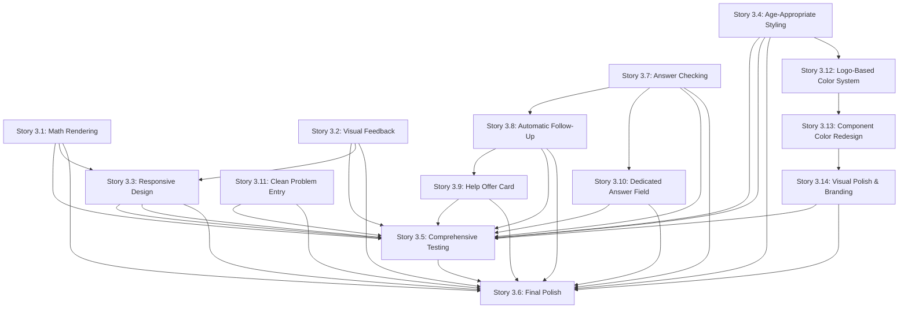

# Epic 3: Visual Feedback & Math Rendering - Story Breakdown

## Overview

Epic 3 delivers the visual and mathematical rendering capabilities that complete the system, ensuring the product is fully functional and ready for deployment. This epic includes 14 stories that build upon each other to create a polished, age-appropriate user experience with cohesive branding.

## Story Dependencies

## Recommended Implementation Order

### Phase 1: Core Rendering & Feedback (Stories 3.1, 3.2)

**Goal:** Establish core visual capabilities

1. **Story 3.1: LaTeX/KaTeX Math Rendering Integration** ⭐ Start Here
   - Creates foundational math rendering capability
   - Required by: Stories 3.3, 3.5, 3.6
   - **Dependencies:** Stories 1.8, 2.7 (components exist)

2. **Story 3.2: Visual Feedback Components**
   - Creates progress indicators and encouragement messages
   - Required by: Stories 3.3, 3.5, 3.6
   - **Dependencies:** Story 2.7 (ChatPanel exists)

### Phase 2: Responsive Design & Styling (Stories 3.3, 3.4)

**Goal:** Ensure interface works across devices and looks age-appropriate

3. **Story 3.3: Responsive Design & Mobile Optimization**
   - Ensures interface works on all devices
   - **Dependencies:** Stories 1.2, 1.4, 1.5, 1.8, 2.7, 3.1, 3.2
   - Required by: Stories 3.5, 3.6

4. **Story 3.4: Age-Appropriate Styling with Tailwind CSS**
   - Applies age-appropriate visual design
   - **Dependencies:** Stories 1.2, 1.4, 1.5, 1.8, 2.7, 3.2, 3.3
   - Required by: Stories 3.5, 3.6

### Phase 3: Answer Checking & Engagement (Stories 3.7, 3.8, 3.9, 3.10)

**Goal:** Answer validation and automatic tutor engagement

5. **Story 3.7: Answer Checking and Celebration**
   - Validates student answers and provides celebration feedback
   - **Dependencies:** Stories 2.7, 3.2 (ChatPanel, Visual Feedback components exist)
   - Required by: Stories 3.8, 3.10, 3.5, 3.6

6. **Story 3.8: Automatic Contextual Follow-Up**
   - Automatically generates contextual follow-up messages after answer validation
   - **Dependencies:** Story 3.7 (Answer Checking must be completed first)
   - Required by: Story 3.9, 3.5, 3.6

7. **Story 3.9: Optional Help Offer Card**
   - Displays optional help offer card after follow-up message
   - **Dependencies:** Story 3.8 (Automatic Follow-Up must be completed first)
   - Required by: Stories 3.5, 3.6

8. **Story 3.10: Dedicated Answer Field in Problem Panel**
   - Provides dedicated Answer field in Problem Panel for explicit answer submission
   - **Dependencies:** Stories 3.7, 1.8, 3.2 (Answer checking service, Problem Panel, Visual Feedback components exist)
   - Required by: Stories 3.5, 3.6

### Phase 4: Color Theme & Branding (Stories 3.12, 3.13, 3.14)

**Goal:** Implement cohesive logo-based color system and branding

9. **Story 3.12: Logo-Based Color System Foundation**
   - Establishes logo-based color palette in CSS
   - **Dependencies:** Story 3.4 (Age-Appropriate Styling must exist)
   - Required by: Stories 3.13, 3.14

10. **Story 3.13: Component Color Redesign**
   - Updates all components to use logo-based colors
   - **Dependencies:** Story 3.12 (Color system must be established)
   - Required by: Story 3.14

11. **Story 3.14: Visual Polish & Branding**
   - Adds gradients, shadows, animations, and logo integration
   - **Dependencies:** Story 3.13 (Components must use new colors)
   - Required by: Stories 3.5, 3.6

### Phase 5: Testing & Polish (Stories 3.5, 3.6)

**Goal:** Comprehensive testing and final polish

12. **Story 3.5: Comprehensive Testing Across All 5 Problem Types** ⭐ Critical
   - Validates system works for all problem types
   - **Dependencies:** All previous stories (Epic 1, Epic 2, Stories 3.1-3.4, 3.7-3.11, 3.12-3.14)
   - Required by: Story 3.6

13. **Story 3.6: Final UI Polish & Error Handling** ⭐ Final
   - Final polish and error handling
   - **Dependencies:** All previous stories (Epic 1, Epic 2, Stories 3.1-3.5, 3.7-3.11, 3.12-3.14)
   - **Final Story:** Completes Epic 3

14. **Story 3.11: Clean Problem Entry Screen**
   - Clean, minimal problem entry interface
   - **Dependencies:** Stories 1.8, 3.6 (ProblemPanel exists, UI polish established)
   - Required by: Stories 3.5, 3.6

## Story Summary

### Story 3.1: LaTeX/KaTeX Math Rendering Integration

**Priority:** Critical  
**Complexity:** Medium  
**Dependencies:** Stories 1.8, 2.7  
**Estimate:** 2-3 days

**What it delivers:**

- Math rendering library installed and configured (KaTeX recommended)
- `MathRenderer.tsx` React component for rendering math expressions
- `mathRendering.ts` utility functions for LaTeX/KaTeX parsing
- Math rendering integrated in ProblemPanel and ChatPanel
- Inline and block math expression support
- Accessibility features (ARIA labels, screen reader support)

**Key Files:**

- `apps/web/src/components/MathRenderer.tsx`
- `apps/web/src/utils/mathRendering.ts`
- Updates to `ProblemPanel.tsx` and `ChatPanel.tsx`

---

### Story 3.2: Visual Feedback Components (Progress Indicators, Encouragement)

**Priority:** High  
**Complexity:** Medium  
**Dependencies:** Story 2.7  
**Estimate:** 2-3 days

**What it delivers:**

- `ProgressIndicator.tsx` component showing problem-solving progress
- `EncouragementMessage.tsx` component for positive reinforcement
- `visualFeedback.ts` utility functions for progress tracking
- `useProgressTracking.ts` custom hook for progress management
- Age-appropriate visual design (colors, emojis, subtle animations)
- Integration with ChatPanel

**Key Files:**

- `apps/web/src/components/ProgressIndicator.tsx`
- `apps/web/src/components/EncouragementMessage.tsx`
- `apps/web/src/utils/visualFeedback.ts`
- `apps/web/src/hooks/useProgressTracking.ts`
- Updates to `ChatPanel.tsx`

---

### Story 3.3: Responsive Design & Mobile Optimization

**Priority:** High  
**Complexity:** Medium-High  
**Dependencies:** Stories 1.2, 1.4, 1.5, 1.8, 2.7, 3.1, 3.2  
**Estimate:** 3-4 days

**What it delivers:**

- Responsive layout adapting to desktop, tablet, and mobile
- Collapsible panels for mobile devices
- Touch-friendly interactive elements (44x44px minimum)
- Optimized math rendering for mobile
- Orientation change handling
- Cross-browser and cross-device testing

**Key Files:**

- Updates to `Layout.tsx` for responsive design
- `apps/web/src/components/CollapsiblePanel.tsx` (if needed)
- `apps/web/src/hooks/useOrientation.ts`
- Updates to all components for mobile optimization

---

### Story 3.4: Age-Appropriate Styling with Tailwind CSS

**Priority:** High  
**Complexity:** Medium  
**Dependencies:** Stories 1.2, 1.4, 1.5, 1.8, 2.7, 3.2, 3.3  
**Estimate:** 2-3 days

**What it delivers:**

- Age-appropriate color palette (friendly, engaging, not overwhelming)
- Typography system for 6th grade students (ages 11-12)
- Consistent styling across all components
- Tailwind CSS configuration with custom design tokens
- WCAG AA compliant color contrast
- Performance-optimized styling

**Key Files:**

- `apps/web/tailwind.config.js` (or equivalent for v4.1.16)
- `apps/web/src/styles/components.ts` (utility classes)
- Updates to all components for consistent styling

---

### Story 3.7: Answer Checking and Celebration

**Priority:** High  
**Complexity:** Medium-High  
**Dependencies:** Stories 2.7, 3.2  
**Estimate:** 3-4 days

**What it delivers:**

- Answer detection utility (heuristic patterns and LLM-based validation)
- Answer checking service (LLM-based validation comparing student answer with correct solution)
- Answer checking API endpoint (`POST /api/answer/check`)
- Celebration component for correct answers (age-appropriate, prominent but non-blocking)
- Integration with ChatPanel for automatic answer detection and validation
- Support for multiple answer formats (numerical, algebraic, text-based)

**Key Files:**

- `apps/web/src/utils/answerDetection.ts`
- `functions/src/services/answerCheckingService.ts`
- `functions/src/controllers/answerController.ts`
- `apps/web/src/components/CelebrationMessage.tsx`
- Updates to `ChatPanel.tsx`

---

### Story 3.8: Automatic Contextual Follow-Up After Answer Validation

**Priority:** High  
**Complexity:** Medium  
**Dependencies:** Story 3.7  
**Estimate:** 2-3 days

**What it delivers:**

- Automatic generation of contextual follow-up messages after answer validation
- Enhanced Socratic dialogue generation with `answerValidationContext` parameter
- Follow-up generation service that maintains Socratic principles
- Contextual messages based on validation result (correct/incorrect/partial)
- Integration with ChatPanel for automatic follow-up display
- All generated messages pass answer detection guardrails

**Key Files:**

- `functions/src/services/followUpGenerationService.ts`
- Updates to `functions/src/services/llmService.ts`
- Updates to `functions/src/controllers/answerController.ts`
- Updates to `apps/web/src/components/ChatPanel.tsx`
- Updates to `apps/web/src/services/api.ts`

**Design Reference:** `docs/ux-design/auto-engagement-after-validation.md`

---

### Story 3.9: Optional Help Offer Card After Follow-Up

**Priority:** Medium  
**Complexity:** Medium  
**Dependencies:** Story 3.8  
**Estimate:** 2-3 days

**What it delivers:**

- Help offer card component (subtle, dismissible, age-appropriate)
- Timer logic for delayed display (5-10 seconds after follow-up)
- Auto-dismiss functionality (15 seconds or when student engages)
- Step-by-step guidance service (maintains Socratic principles)
- Integration with ChatPanel for help offer display
- Accessibility features (screen readers, keyboard navigation)

**Key Files:**

- `apps/web/src/components/HelpOfferCard.tsx`
- `functions/src/services/stepByStepGuidanceService.ts`
- Updates to `functions/src/controllers/chatController.ts`
- Updates to `apps/web/src/components/ChatPanel.tsx`
- Updates to `apps/web/src/services/api.ts`

**Design Reference:** `docs/ux-design/auto-engagement-after-validation.md`

---

### Story 3.5: Comprehensive Testing Across All 5 Problem Types

**Priority:** Critical  
**Complexity:** High  
**Dependencies:** All previous stories (Epic 1, Epic 2, Stories 3.1-3.4)  
**Estimate:** 4-5 days

**What it delivers:**

- Comprehensive test cases for all 5 problem types (arithmetic, algebra, geometry, word, multi-step)
- Testing documentation with test results
- Socratic compliance verification (100% adherence)
- Math rendering validation across all problem types
- Visual feedback appropriateness assessment
- Responsive design validation across devices
- Deployment readiness validation

**Key Files:**

- Testing documentation (test cases, results, reports)
- Updates to Developer Testing Interface (if needed)
- Test problem library enhancements (if needed)

---

### Story 3.10: Dedicated Answer Field in Problem Panel

**Priority:** High  
**Complexity:** Medium  
**Dependencies:** Stories 3.7, 1.8, 3.2  
**Estimate:** 3-4 days

**What it delivers:**

- `AnswerInput.tsx` component with text input and image upload support
- Integration with Problem Panel component
- Connection to existing answer checking service
- Multiple feedback states (checking, correct, incorrect, partial)
- Image upload support for handwritten answers
- Responsive design for all devices
- Accessibility features (ARIA labels, keyboard navigation)
- Integration with passive detection (hybrid approach)

**Key Files:**

- `apps/web/src/components/AnswerInput.tsx`
- Updates to `apps/web/src/components/ProblemPanel.tsx`
- Updates to answer checking integration (if needed)
- Image upload handling for handwritten answers

---

### Story 3.11: Clean Problem Entry Screen

**Priority:** Medium  
**Complexity:** Low  
**Dependencies:** Stories 1.8, 3.6  
**Estimate:** 1-2 days

**What it delivers:**

- Minimal, clean problem entry screen showing only the input
- Text input automatically hidden when image is uploaded
- Simplified ProblemPanel empty state (no extra headers or UI elements)
- Clean, focused interface for problem entry

**Key Files:**

- Updates to `apps/web/src/components/ProblemInput.tsx`
- Updates to `apps/web/src/components/ProblemPanel.tsx`

---

### Story 3.12: Logo-Based Color System Foundation

**Priority:** High  
**Complexity:** Low-Medium  
**Dependencies:** Story 3.4  
**Estimate:** 1-2 days

**What it delivers:**

- Logo-based color palette extracted from Learn Math logo
- CSS custom properties updated with HSL color values
- Primary colors: Blues (dark, light, sky blue)
- Accent colors: Lime green (vibrant and light variants)
- Background colors: Sky blue tint and soft grey
- Text colors: Dark grey and medium grey
- WCAG AA contrast compliance verification
- Backward compatibility with existing components

**Key Files:**

- `apps/web/src/styles/globals.css` - Color system overhaul

---

### Story 3.13: Component Color Redesign

**Priority:** High  
**Complexity:** Medium  
**Dependencies:** Story 3.12  
**Estimate:** 3-4 days

**What it delivers:**

- All components updated to use logo-based colors
- Layout component with logo and gradients
- Problem Panel with logo-inspired colors
- Chat Panel with redesigned message bubbles (blue for student, green accent for tutor)
- Problem Input with brand-colored buttons
- Message Item with logo blue (not indigo)
- Answer Input with lime green primary button
- Empty State with gradient background
- Visual feedback components with brand colors
- Consistent button styling throughout

**Key Files:**

- `apps/web/src/components/Layout.tsx`
- `apps/web/src/components/ProblemPanel.tsx`
- `apps/web/src/components/ChatPanel.tsx`
- `apps/web/src/components/ProblemInput.tsx`
- `apps/web/src/components/MessageItem.tsx`
- `apps/web/src/components/AnswerInput.tsx`
- `apps/web/src/components/EmptyState.tsx`
- `apps/web/src/components/CelebrationMessage.tsx`
- `apps/web/src/components/EncouragementMessage.tsx`
- `apps/web/src/components/ErrorMessage.tsx`
- `apps/web/src/components/ProgressIndicator.tsx`
- `apps/web/src/components/HelpOfferCard.tsx`
- `apps/web/src/components/ExampleProblems.tsx`

---

### Story 3.14: Visual Polish & Branding

**Priority:** High  
**Complexity:** Medium  
**Dependencies:** Story 3.13  
**Estimate:** 3-4 days

**What it delivers:**

- Gradients throughout (sky blue to lighter blue, lime green to lighter green)
- Colored shadows (primary blue, lime green, subtle depth)
- Smooth animations (color transitions, scale animations, loading animations)
- Micro-interactions (button hover, input focus, success feedback)
- Logo integration (header, empty state, loading states, favicon)
- Logo-inspired elements (calculator icon, math symbols in lime green)
- Responsive design maintained
- Accessibility verified
- Cross-browser compatibility verified
- Final polish complete

**Key Files:**

- `apps/web/src/components/Layout.tsx` - Logo integration
- `apps/web/src/components/EmptyState.tsx` - Logo integration
- `apps/web/src/components/LoadingIndicator.tsx` - Logo animation
- `apps/web/src/components/CelebrationMessage.tsx` - Brand color animations
- `apps/web/src/components/EncouragementMessage.tsx` - Brand color animations
- `apps/web/src/styles/globals.css` - Gradients, shadows, animations
- `apps/web/public/` - Favicon
- All component files - Final polish pass

---

### Story 3.6: Final UI Polish & Error Handling

**Priority:** Critical  
**Complexity:** Medium-High  
**Dependencies:** All previous stories (Epic 1, Epic 2, Stories 3.1-3.5)  
**Estimate:** 3-4 days

**What it delivers:**

- Final UI polish (consistent styling, smooth transitions)
- Comprehensive error handling (API failures, network errors, invalid input)
- Age-appropriate error messages with actionable guidance
- Loading states throughout the interface
- Edge case handling (empty input, session expiration, network disconnections)
- Cross-browser and cross-device testing
- Deployment readiness

**Key Files:**

- `apps/web/src/components/ErrorMessage.tsx`
- `apps/web/src/components/LoadingIndicator.tsx`
- `apps/web/src/utils/errorHandling.ts`
- Updates to all components for error handling and polish

## Implementation Phases Summary

### Phase 1: Core Rendering & Feedback (Week 1)

- Story 3.1: Math Rendering
- Story 3.2: Visual Feedback

**Deliverable:** Core visual capabilities ready

### Phase 2: Responsive Design & Styling (Week 2)

- Story 3.3: Responsive Design
- Story 3.4: Age-Appropriate Styling

**Deliverable:** Interface works across devices and looks age-appropriate

### Phase 3: Answer Checking & Engagement (Week 3-4)

- Story 3.7: Answer Checking and Celebration
- Story 3.8: Automatic Contextual Follow-Up
- Story 3.9: Optional Help Offer Card
- Story 3.10: Dedicated Answer Field in Problem Panel

**Deliverable:** Answer validation and automatic engagement features ready, including dedicated Answer field

### Phase 4: Color Theme & Branding (Week 4-5)

- Story 3.12: Logo-Based Color System Foundation
- Story 3.13: Component Color Redesign
- Story 3.14: Visual Polish & Branding

**Deliverable:** Cohesive logo-based color system and branding complete

### Phase 5: Testing & Polish (Week 5-6)

- Story 3.5: Comprehensive Testing
- Story 3.6: Final Polish
- Story 3.11: Clean Problem Entry Screen

**Deliverable:** Complete Epic 3 functionality, ready for deployment

## Total Epic Estimate

**Total Stories:** 14  
**Total Estimated Time:** 34-48 days (~6-8 weeks)  
**Critical Path:** Stories 3.1 → 3.3 → 3.4 → 3.12 → 3.13 → 3.14 → 3.7 → 3.8 → 3.9 → 3.10 → 3.5 → 3.6

## Key Integration Points

1. **Math Rendering (3.1)** → Used by: ProblemPanel, ChatPanel, Responsive Design (3.3), Testing (3.5)
2. **Visual Feedback (3.2)** → Used by: ChatPanel, Responsive Design (3.3), Styling (3.4), Answer Checking (3.7), Testing (3.5)
3. **Responsive Design (3.3)** → Enhances: All components, Testing (3.5), Final Polish (3.6)
4. **Age-Appropriate Styling (3.4)** → Enhances: All components, Testing (3.5), Final Polish (3.6)
5. **Answer Checking (3.7)** → Enables: Automatic Follow-Up (3.8), Help Offer Card (3.9), Dedicated Answer Field (3.10), Testing (3.5)
6. **Automatic Follow-Up (3.8)** → Enables: Help Offer Card (3.9), Testing (3.5)
7. **Help Offer Card (3.9)** → Enhances: Engagement features, Testing (3.5)
8. **Dedicated Answer Field (3.10)** → Enhances: Answer submission clarity, Testing (3.5)
9. **Comprehensive Testing (3.5)** → Validates: All previous work, Prepares for: Final Polish (3.6)
10. **Logo-Based Color System (3.12)** → Establishes: Color foundation, Required by: Component Redesign (3.13)
11. **Component Color Redesign (3.13)** → Updates: All components, Required by: Visual Polish (3.14)
12. **Visual Polish & Branding (3.14)** → Adds: Gradients, animations, logo, Required by: Testing (3.5), Final Polish (3.6)
13. **Final Polish (3.6)** → Completes: Epic 3, Prepares for: Deployment
14. **Clean Problem Entry (3.11)** → Enhances: Problem entry UX, Testing (3.5), Final Polish (3.6)

## Testing Strategy

Each story should include:

- Unit tests for utility functions and components
- Integration tests for component interactions
- Manual testing via Developer Testing Interface (from Epic 1)
- Visual regression testing for styling changes
- Cross-browser and cross-device testing

## Notes

- Math rendering should use KaTeX (recommended) for better performance and smaller bundle size
- Visual feedback should be age-appropriate for 6th grade students (ages 11-12)
- Responsive design should be mobile-first approach
- Age-appropriate styling should be friendly but not childish
- Comprehensive testing should verify 100% Socratic compliance
- All error messages should be age-appropriate with actionable guidance
- System should be ready for deployment after Epic 3 completion
