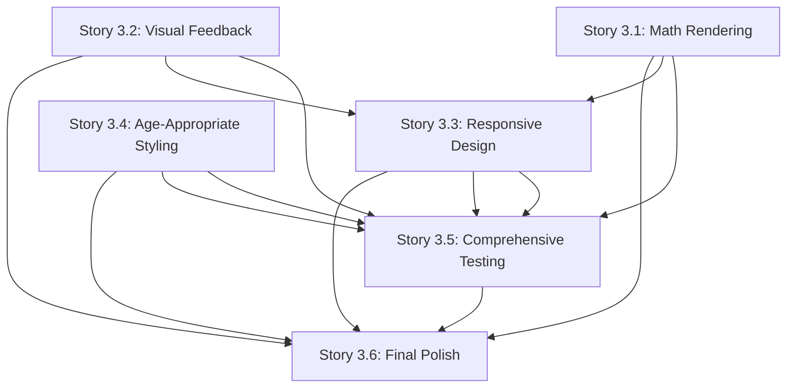

# Epic 3: Visual Feedback & Math Rendering - Story Breakdown

## Overview

Epic 3 delivers the visual and mathematical rendering capabilities that complete the system, ensuring the product is fully functional and ready for deployment. This epic includes 6 stories that build upon each other to create a polished, age-appropriate user experience.

## Story Dependencies

## Recommended Implementation Order

### Phase 1: Core Rendering & Feedback (Stories 3.1, 3.2)

**Goal:** Establish core visual capabilities

1. **Story 3.1: LaTeX/KaTeX Math Rendering Integration** ⭐ Start Here
   - Creates foundational math rendering capability
   - Required by: Stories 3.3, 3.5, 3.6
   - **Dependencies:** Stories 1.8, 2.7 (components exist)

2. **Story 3.2: Visual Feedback Components**
   - Creates progress indicators and encouragement messages
   - Required by: Stories 3.3, 3.5, 3.6
   - **Dependencies:** Story 2.7 (ChatPanel exists)

### Phase 2: Responsive Design & Styling (Stories 3.3, 3.4)

**Goal:** Ensure interface works across devices and looks age-appropriate

3. **Story 3.3: Responsive Design & Mobile Optimization**
   - Ensures interface works on all devices
   - **Dependencies:** Stories 1.2, 1.4, 1.5, 1.8, 2.7, 3.1, 3.2
   - Required by: Stories 3.5, 3.6

4. **Story 3.4: Age-Appropriate Styling with Tailwind CSS**
   - Applies age-appropriate visual design
   - **Dependencies:** Stories 1.2, 1.4, 1.5, 1.8, 2.7, 3.2, 3.3
   - Required by: Stories 3.5, 3.6

### Phase 3: Testing & Polish (Stories 3.5, 3.6)

**Goal:** Comprehensive testing and final polish

5. **Story 3.5: Comprehensive Testing Across All 5 Problem Types** ⭐ Critical
   - Validates system works for all problem types
   - **Dependencies:** All previous stories (Epic 1, Epic 2, Stories 3.1-3.4)
   - Required by: Story 3.6

6. **Story 3.6: Final UI Polish & Error Handling** ⭐ Final
   - Final polish and error handling
   - **Dependencies:** All previous stories (Epic 1, Epic 2, Stories 3.1-3.5)
   - **Final Story:** Completes Epic 3

## Story Summary

### Story 3.1: LaTeX/KaTeX Math Rendering Integration

**Priority:** Critical  
**Complexity:** Medium  
**Dependencies:** Stories 1.8, 2.7  
**Estimate:** 2-3 days

**What it delivers:**

- Math rendering library installed and configured (KaTeX recommended)
- `MathRenderer.tsx` React component for rendering math expressions
- `mathRendering.ts` utility functions for LaTeX/KaTeX parsing
- Math rendering integrated in ProblemPanel and ChatPanel
- Inline and block math expression support
- Accessibility features (ARIA labels, screen reader support)

**Key Files:**

- `apps/web/src/components/MathRenderer.tsx`
- `apps/web/src/utils/mathRendering.ts`
- Updates to `ProblemPanel.tsx` and `ChatPanel.tsx`

---

### Story 3.2: Visual Feedback Components (Progress Indicators, Encouragement)

**Priority:** High  
**Complexity:** Medium  
**Dependencies:** Story 2.7  
**Estimate:** 2-3 days

**What it delivers:**

- `ProgressIndicator.tsx` component showing problem-solving progress
- `EncouragementMessage.tsx` component for positive reinforcement
- `visualFeedback.ts` utility functions for progress tracking
- `useProgressTracking.ts` custom hook for progress management
- Age-appropriate visual design (colors, emojis, subtle animations)
- Integration with ChatPanel

**Key Files:**

- `apps/web/src/components/ProgressIndicator.tsx`
- `apps/web/src/components/EncouragementMessage.tsx`
- `apps/web/src/utils/visualFeedback.ts`
- `apps/web/src/hooks/useProgressTracking.ts`
- Updates to `ChatPanel.tsx`

---

### Story 3.3: Responsive Design & Mobile Optimization

**Priority:** High  
**Complexity:** Medium-High  
**Dependencies:** Stories 1.2, 1.4, 1.5, 1.8, 2.7, 3.1, 3.2  
**Estimate:** 3-4 days

**What it delivers:**

- Responsive layout adapting to desktop, tablet, and mobile
- Collapsible panels for mobile devices
- Touch-friendly interactive elements (44x44px minimum)
- Optimized math rendering for mobile
- Orientation change handling
- Cross-browser and cross-device testing

**Key Files:**

- Updates to `Layout.tsx` for responsive design
- `apps/web/src/components/CollapsiblePanel.tsx` (if needed)
- `apps/web/src/hooks/useOrientation.ts`
- Updates to all components for mobile optimization

---

### Story 3.4: Age-Appropriate Styling with Tailwind CSS

**Priority:** High  
**Complexity:** Medium  
**Dependencies:** Stories 1.2, 1.4, 1.5, 1.8, 2.7, 3.2, 3.3  
**Estimate:** 2-3 days

**What it delivers:**

- Age-appropriate color palette (friendly, engaging, not overwhelming)
- Typography system for 6th grade students (ages 11-12)
- Consistent styling across all components
- Tailwind CSS configuration with custom design tokens
- WCAG AA compliant color contrast
- Performance-optimized styling

**Key Files:**

- `apps/web/tailwind.config.js` (or equivalent for v4.1.16)
- `apps/web/src/styles/components.ts` (utility classes)
- Updates to all components for consistent styling

---

### Story 3.5: Comprehensive Testing Across All 5 Problem Types

**Priority:** Critical  
**Complexity:** High  
**Dependencies:** All previous stories (Epic 1, Epic 2, Stories 3.1-3.4)  
**Estimate:** 4-5 days

**What it delivers:**

- Comprehensive test cases for all 5 problem types (arithmetic, algebra, geometry, word, multi-step)
- Testing documentation with test results
- Socratic compliance verification (100% adherence)
- Math rendering validation across all problem types
- Visual feedback appropriateness assessment
- Responsive design validation across devices
- Deployment readiness validation

**Key Files:**

- Testing documentation (test cases, results, reports)
- Updates to Developer Testing Interface (if needed)
- Test problem library enhancements (if needed)

---

### Story 3.6: Final UI Polish & Error Handling

**Priority:** Critical  
**Complexity:** Medium-High  
**Dependencies:** All previous stories (Epic 1, Epic 2, Stories 3.1-3.5)  
**Estimate:** 3-4 days

**What it delivers:**

- Final UI polish (consistent styling, smooth transitions)
- Comprehensive error handling (API failures, network errors, invalid input)
- Age-appropriate error messages with actionable guidance
- Loading states throughout the interface
- Edge case handling (empty input, session expiration, network disconnections)
- Cross-browser and cross-device testing
- Deployment readiness

**Key Files:**

- `apps/web/src/components/ErrorMessage.tsx`
- `apps/web/src/components/LoadingIndicator.tsx`
- `apps/web/src/utils/errorHandling.ts`
- Updates to all components for error handling and polish

## Implementation Phases Summary

### Phase 1: Core Rendering & Feedback (Week 1)

- Story 3.1: Math Rendering
- Story 3.2: Visual Feedback

**Deliverable:** Core visual capabilities ready

### Phase 2: Responsive Design & Styling (Week 2)

- Story 3.3: Responsive Design
- Story 3.4: Age-Appropriate Styling

**Deliverable:** Interface works across devices and looks age-appropriate

### Phase 3: Testing & Polish (Week 3-4)

- Story 3.5: Comprehensive Testing
- Story 3.6: Final Polish

**Deliverable:** Complete Epic 3 functionality, ready for deployment

## Total Epic Estimate

**Total Stories:** 6  
**Total Estimated Time:** 16-22 days (~3-4.5 weeks)  
**Critical Path:** Stories 3.1 → 3.3 → 3.5 → 3.6

## Key Integration Points

1. **Math Rendering (3.1)** → Used by: ProblemPanel, ChatPanel, Responsive Design (3.3), Testing (3.5)
2. **Visual Feedback (3.2)** → Used by: ChatPanel, Responsive Design (3.3), Styling (3.4), Testing (3.5)
3. **Responsive Design (3.3)** → Enhances: All components, Testing (3.5), Final Polish (3.6)
4. **Age-Appropriate Styling (3.4)** → Enhances: All components, Testing (3.5), Final Polish (3.6)
5. **Comprehensive Testing (3.5)** → Validates: All previous work, Prepares for: Final Polish (3.6)
6. **Final Polish (3.6)** → Completes: Epic 3, Prepares for: Deployment

## Testing Strategy

Each story should include:

- Unit tests for utility functions and components
- Integration tests for component interactions
- Manual testing via Developer Testing Interface (from Epic 1)
- Visual regression testing for styling changes
- Cross-browser and cross-device testing

## Notes

- Math rendering should use KaTeX (recommended) for better performance and smaller bundle size
- Visual feedback should be age-appropriate for 6th grade students (ages 11-12)
- Responsive design should be mobile-first approach
- Age-appropriate styling should be friendly but not childish
- Comprehensive testing should verify 100% Socratic compliance
- All error messages should be age-appropriate with actionable guidance
- System should be ready for deployment after Epic 3 completion

