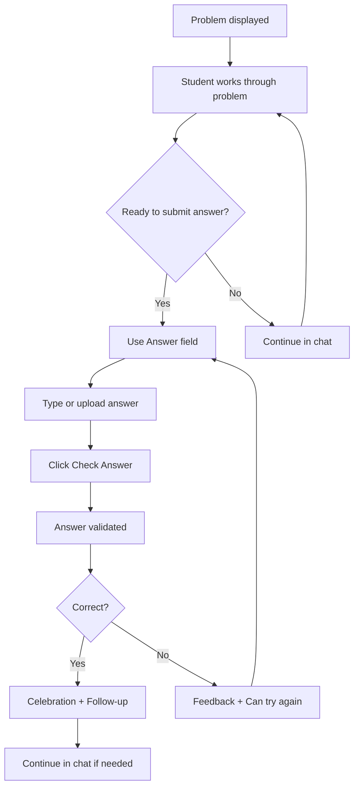

# UX Recommendation: Dedicated Answer Field

## Problem Statement

The current interface uses passive answer detection in the chat, which can be confusing for 6th grade students who may not understand:
- When they're submitting an answer vs. asking a question
- Whether their answer format will be detected correctly
- If they need to explicitly phrase their answer in a certain way

## Recommendation: Dedicated Answer Field

### Primary Approach: Dedicated Answer Section

Add a dedicated **Answer** section in the Problem Panel (left side), clearly separated from the chat dialogue.

### Benefits

1. **Clear Intent**: Students know exactly where to submit their final answer
2. **Reduced Ambiguity**: No guessing about whether message will be detected as answer
3. **Image Upload Support**: Can upload handwritten answers (important for math work)
4. **Better UX Clarity**: Explicit action of "checking answer" vs. "continuing conversation"
5. **Reliable Checking**: Guaranteed answer format for checking service
6. **Visual Separation**: Problem → Answer → Chat (clear mental model)

### Design Options

#### Option A: Answer Field in Problem Panel (Recommended)

**Location**: Problem Panel (left side), below the problem display

**Layout**:
```
┌─────────────────────────┐
│ Math Problem            │
├─────────────────────────┤
│ Problem Statement       │
│ (displayed here)       │
├─────────────────────────┤
│ Your Answer             │
│ ┌─────────────────────┐ │
│ │ [Text input]        │ │
│ │ or                  │ │
│ │ [Upload image]      │ │
│ └─────────────────────┘ │
│ [Check Answer] button   │
└─────────────────────────┘

┌─────────────────────────┐
│ Chat (right side)       │
│ (for questions/help)    │
└─────────────────────────┘
```

**Features**:
- Text input field labeled "Your Answer"
- Optional image upload button for handwritten work
- "Check Answer" button (primary action)
- Visual distinction from chat (different styling)
- Can still use chat for questions/help

**Pros**:
- Clear separation: Problem → Answer → Chat
- Visual proximity to problem (helps context)
- Supports both text and image answers
- Doesn't clutter chat interface

**Cons**:
- Requires scrolling if problem is long
- May feel more "formal" than conversational

#### Option B: Answer Field in Chat (Alternative)

**Location**: Chat panel, but visually distinct section at top

**Layout**:
```
┌─────────────────────────┐
│ Math Problem (left)      │
└─────────────────────────┘

┌─────────────────────────┐
│ ┌─────────────────────┐ │
│ │ Your Answer         │ │
│ │ [Input field]       │ │
│ │ [Check Answer]      │ │
│ └─────────────────────┘ │
│ ─────────────────────── │
│ Chat Messages           │
│ (questions/help)        │
│ ┌─────────────────────┐ │
│ │ [Chat input]        │ │
│ └─────────────────────┘ │
└─────────────────────────┘
```

**Pros**:
- Everything in one panel
- Still feels conversational

**Cons**:
- Less clear separation
- May confuse answer vs. chat input
- Harder to support image upload prominently

### Recommended Implementation: Option A

**Why Option A?**
1. Better visual separation matches mental model: Problem → Answer → Discussion
2. Supports image upload more naturally (can be larger, more prominent)
3. Keeps chat focused on questions/help without confusion
4. Problem and answer are visually connected (left panel)
5. More scalable if we add answer history later

### Design Specifications

#### Answer Section UI

**Visual Design**:
- Clear heading: "Your Answer" or "Submit Your Answer"
- Input field with placeholder: "Type your answer here..." or "Enter your answer (e.g., 5, x = 3, or upload image)"
- Image upload button: "Upload Handwritten Answer" (optional, secondary)
- Primary button: "Check Answer" (green/primary color, prominent)
- Visual distinction: Different background color or border from problem display
- Accessible: Clear labels, ARIA attributes, keyboard navigation

**States**:
- **Empty**: Input field ready, button enabled
- **Typing**: Input field active, button enabled
- **Checking**: Input disabled, button shows loading spinner, "Checking..."
- **Correct**: Celebration appears, answer field cleared/reset
- **Incorrect**: Feedback message, answer field remains (student can try again)
- **Error**: Error message, answer field remains

**Interaction**:
- Text input: Multi-line support for longer answers
- Image upload: Drag-and-drop or click to upload
- Check Answer: Submits answer for validation
- After checking: Clear feedback, then student can modify and try again OR continue in chat

#### Integration with Current Flow

**Hybrid Approach** (Best UX):
1. **Primary**: Dedicated Answer field (explicit, clear)
2. **Secondary**: Keep passive detection in chat as fallback (for convenience)
3. **Behavior**: If answer detected in chat, show confirmation: "Looks like you're submitting an answer! Use the Answer field below the problem for better results, or continue here."

**Rationale**:
- Provides clear primary path (Answer field)
- Maintains flexibility for students who prefer typing in chat
- Educates users about preferred method over time

### User Flow



### Accessibility Considerations

- **Screen Readers**: Clear announcement: "Answer field: Enter your answer here"
- **Keyboard Navigation**: Tab order: Problem → Answer field → Check Answer button → Chat
- **Visual Design**: High contrast, clear labels, error states clearly indicated
- **Mobile**: Touch-friendly targets (≥44px), responsive layout

### Age-Appropriate Design

**Language**:
- "Your Answer" (clear, friendly)
- "Check Answer" (action-oriented, not intimidating)
- "Upload Handwritten Answer" (optional, secondary)

**Visual**:
- Friendly colors (not harsh red for errors)
- Encouraging messages
- Clear success/error states

### Technical Implementation Notes

**Components Needed**:
- `AnswerInput.tsx` - Answer input field component
- `AnswerCheckButton.tsx` - Check answer button with states
- Integration with existing `ProblemPanel.tsx`
- Integration with existing answer checking service

**State Management**:
- Track answer input state
- Track answer checking status
- Handle answer validation results
- Manage celebration/feedback display

**API Integration**:
- Use existing `/api/answer/check` endpoint
- Support both text and image uploads
- Handle validation responses

### Migration Strategy

**Phase 1**: Add Answer field alongside existing chat detection
- Implement Answer field in Problem Panel
- Keep passive detection active
- Show gentle nudge: "Tip: Use the Answer field for best results"

**Phase 2**: Make Answer field primary, detection secondary
- Answer field becomes recommended method
- Passive detection still works but shows confirmation prompt

**Phase 3**: Evaluate usage, consider deprecating passive detection
- Monitor which method students prefer
- Gather feedback on UX clarity
- Decide if both methods are needed long-term

### Success Metrics

- **Clarity**: Students understand where to submit answers (user testing)
- **Reliability**: Answer checking success rate improves
- **Engagement**: Students use Answer field as primary method
- **Satisfaction**: Reduced confusion about answer submission

### Open Questions

1. Should Answer field be required, or is chat detection still acceptable?
2. Should we show answer history (previous attempts)?
3. Should Answer field persist after correct answer, or clear?
4. How prominent should image upload be (primary vs. secondary)?

### Recommendation Summary

**YES, add a dedicated Answer field** in the Problem Panel (Option A) because:
1. Significantly improves UX clarity for 6th grade students
2. Supports image uploads for handwritten work
3. Reduces ambiguity about answer submission
4. Maintains natural conversation flow in chat
5. Better aligns with mental model: Problem → Answer → Discussion

**Implementation**: Hybrid approach - Answer field as primary, chat detection as fallback for convenience.


