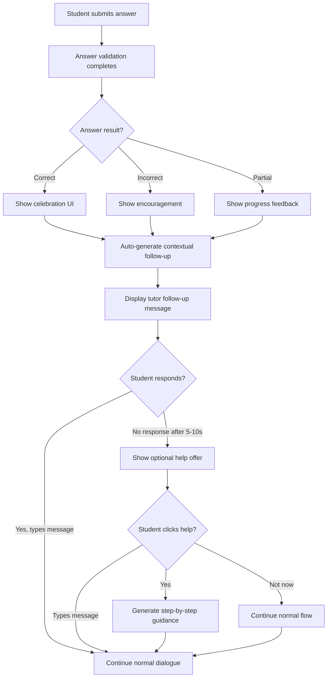

# UX Design: Automatic Tutor Engagement After Answer Validation

## Overview

This document defines the user experience pattern for automatic AI tutor engagement when a student's answer is validated (correct or incorrect). The design maintains Socratic teaching principles while providing natural, contextual help that enhances learning without being intrusive.

## Design Goals

1. **Natural Flow:** Engagement feels like a natural continuation of the conversation, not an interruption
2. **Socratic Compliance:** All interactions maintain Socratic principles (no direct answers, guided discovery)
3. **Age-Appropriate:** Designed for 6th grade students (ages 11-12) with encouraging, friendly language
4. **Non-Intrusive:** Students can continue working even if they don't engage with the prompt
5. **Contextual:** Engagement adapts based on whether the answer was correct, incorrect, or partial

## Engagement Patterns

### Pattern 1: Automatic Contextual Follow-Up (Primary)

**When:** Immediately after answer validation completes (correct, incorrect, or partial)

**How:** The tutor automatically generates a contextual follow-up message that appears as a normal tutor message in the chat flow.

**For Correct Answers:**
- Celebrates the correct answer
- Asks a Socratic question to deepen understanding
- Examples:
  - "That's correct! 🎉 Can you walk me through how you got that answer?"
  - "Great job! What steps did you take to solve this?"
  - "Excellent! Can you explain your thinking? I'd love to hear your process."

**For Incorrect Answers:**
- Acknowledges the attempt without judgment
- Offers to work through it together
- Examples:
  - "I see you're working on this! Let's think about it together. What part of the problem are you trying to solve first?"
  - "Thanks for trying! Let's break this down step by step. What information do we have?"
  - "Let's work through this together. What do you think might help us get started?"

**For Partial Answers:**
- Acknowledges progress
- Encourages completion
- Examples:
  - "You're on the right track! What's the next step you think we should take?"
  - "Good thinking so far! What else do we need to figure out?"
  - "Nice start! Let's think about what comes next."

### Pattern 2: Optional Help Offer (Secondary)

**When:** After the automatic follow-up, if the student hasn't responded after 5-10 seconds

**How:** A subtle, dismissible prompt appears below the tutor's message offering additional help.

**Visual Design:**
- Small card/banner below the tutor's follow-up message
- Soft, friendly colors (e.g., light blue background, friendly icon)
- Text: "Need help breaking this down? I can guide you step-by-step!" or "Want me to walk through this problem with you?"
- Clickable action button: "Yes, please!" or "Let's do it!"
- Dismissible: Small "X" or "Not now" button
- Auto-dismisses after 15 seconds if not interacted with

**Interaction:**
- If student clicks "Yes" → Tutor generates a more detailed Socratic breakdown message
- If student clicks "Not now" → Prompt disappears, student can continue normally
- If student types a message → Prompt automatically dismisses (student is engaging)

## Implementation Details

### Flow Diagram

### Message Generation Logic

**Automatic Follow-Up Generation:**
- Use existing `generateSocraticDialogue` function
- Add special context: "Student just submitted answer: [result]. Generate a natural follow-up that maintains Socratic principles."
- For correct answers: Focus on understanding process ("Can you explain how you got that?")
- For incorrect answers: Focus on guiding discovery ("Let's work through this together")
- For partial answers: Focus on next steps ("What should we figure out next?")

**Help Offer Generation:**
- Use a predefined template system with variations
- Context-aware: Adjusts based on problem type and validation result
- Maintains Socratic principles: Even "help" is guided discovery, not direct answers

### UI Components

**1. Answer Validation Result Badge**
- Appears above chat when validation completes
- Shows: "✓ Correct!" (green), "Keep trying!" (yellow), or "Partial answer" (blue)
- Auto-dismisses after 3 seconds
- Non-blocking, doesn't interrupt chat flow

**2. Automatic Follow-Up Message**
- Normal tutor message in chat
- Appears immediately after validation
- Styled like regular tutor messages
- No special UI treatment (feels natural)

**3. Optional Help Offer Card**
- Small, dismissible card below tutor message
- Appears after 5-10 second delay if no student response
- Soft animation (fade-in, subtle slide)
- Accessible: ARIA labels, keyboard navigable
- Mobile-friendly: Touch targets ≥44px

### Timing Considerations

**Immediate Actions:**
- Answer validation: < 2 seconds (from Story 3.7 AC:9)
- Celebration/feedback display: Immediate
- Automatic follow-up message: Immediate (generated in parallel with celebration)

**Delayed Actions:**
- Optional help offer: 5-10 seconds after follow-up (if no student response)
- Help offer auto-dismiss: 15 seconds (if not interacted with)

**User Control:**
- Students can dismiss help offer at any time
- Students can continue typing/chatting normally
- No forced engagement - always optional

## Socratic Compliance

**Critical Rules:**
1. Follow-up messages must maintain Socratic principles
2. Even "help" offers must guide discovery, not give answers
3. All generated messages must pass answer detection guardrails
4. Language should encourage thinking, not reveal solutions

**Example Messages (Compliant):**
- ✅ "That's correct! Can you explain your thinking?"
- ✅ "Let's work through this together. What information do we have?"
- ✅ "What do you think might help us get started?"

**Example Messages (Non-Compliant):**
- ❌ "That's correct! The answer is 42."
- ❌ "Let me show you the solution: [step-by-step answer]"
- ❌ "You should use the formula: [formula]"

## Accessibility

**Screen Readers:**
- Announce validation results: "Answer validated: Correct" or "Answer validated: Incorrect"
- Announce help offers: "Help available: Would you like step-by-step guidance?"
- All interactive elements have proper ARIA labels

**Keyboard Navigation:**
- Help offer buttons are keyboard accessible
- Tab order: Validation badge → Follow-up message → Help offer → Chat input
- Escape key dismisses help offer

**Visual Design:**
- High contrast for validation badges
- Clear visual hierarchy for help offers
- Color is not the only indicator (icons, text also used)

## Responsive Design

**Desktop:**
- Help offer appears as card below tutor message
- Full text visible
- Hover states for interactive elements

**Tablet:**
- Same layout as desktop
- Touch-friendly targets (≥44px)
- Swipe-to-dismiss for help offer

**Mobile:**
- Compact help offer card
- Stacked layout if needed
- Touch-optimized buttons

## Age-Appropriate Design

**Language:**
- Friendly, encouraging tone
- Avoid jargon or complex vocabulary
- Use "we" language ("Let's work through this together")
- Positive reinforcement ("Great job!", "You're doing well!")

**Visual Elements:**
- Friendly colors (warm blues, greens, yellows)
- Simple icons (checkmarks, lightbulbs, hands)
- Subtle animations (gentle fade, soft bounce)
- Emojis used sparingly and appropriately

**Interaction Patterns:**
- Clear calls-to-action ("Let's do it!", "Yes, please!")
- Easy dismissal ("Not now", "Maybe later")
- No pressure or urgency

## Technical Implementation Notes

### Backend Changes

**Answer Validation Endpoint Enhancement:**
- Return validation result with context for follow-up generation
- Include flag: `shouldGenerateFollowUp: true`
- Include `answerResult: 'correct' | 'incorrect' | 'partial'`

**Socratic Dialogue Generation:**
- Add new parameter: `answerValidationContext?: { result: 'correct' | 'incorrect' | 'partial', studentAnswer: string }`
- Adjust prompt to generate contextual follow-ups
- Ensure all generated messages pass answer detection guardrails

### Frontend Changes

**ChatPanel Component:**
- Listen for answer validation events
- Display validation result badge
- Trigger automatic follow-up message generation
- Show optional help offer after delay
- Handle help offer interactions

**New Components:**
- `AnswerValidationBadge.tsx` - Displays validation result
- `HelpOfferCard.tsx` - Optional help prompt
- Integration with existing `EncouragementMessage` component

**State Management:**
- Track answer validation state
- Track help offer visibility/timing
- Manage auto-dismiss timers

## User Testing Considerations

**Test Scenarios:**
1. Student gets correct answer → Verify follow-up appears and maintains Socratic principles
2. Student gets incorrect answer → Verify encouraging follow-up, verify help offer appears
3. Student ignores help offer → Verify auto-dismiss, verify normal flow continues
4. Student clicks help offer → Verify step-by-step guidance maintains Socratic principles
5. Student types message immediately → Verify help offer doesn't appear (interrupted)

**Success Metrics:**
- Follow-up messages maintain 100% Socratic compliance
- Help offer click-through rate: 30-50% (indicates value)
- No user complaints about interruptions or forced engagement
- Students continue dialogue naturally after validation

## Future Enhancements

**Potential Additions:**
1. **Adaptive Timing:** Adjust help offer delay based on student behavior history
2. **Personalized Prompts:** Customize help offer language based on student preferences
3. **Multi-Step Guidance:** Progressive help that reveals more over time
4. **Visual Breakdown:** Optional diagram/visual aid alongside text guidance
5. **Confidence Tracking:** Adjust engagement based on student confidence signals

## Dependencies

- Story 3.7: Answer Checking and Celebration (must be completed first)
- Existing Socratic dialogue generation system
- Answer detection guardrails (must pass all generated messages)

## Notes

- This design maintains the natural conversation flow while enhancing learning opportunities
- All engagement is optional - students always have control
- Socratic principles are maintained at all times
- Design is age-appropriate for 6th grade students
- Implementation should be non-blocking and performant

